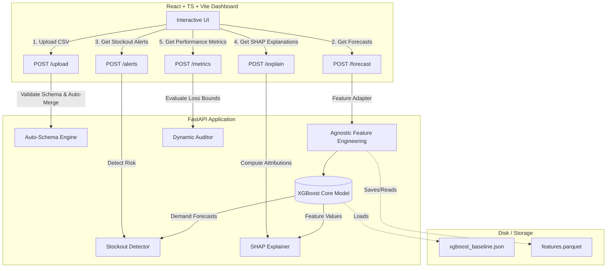
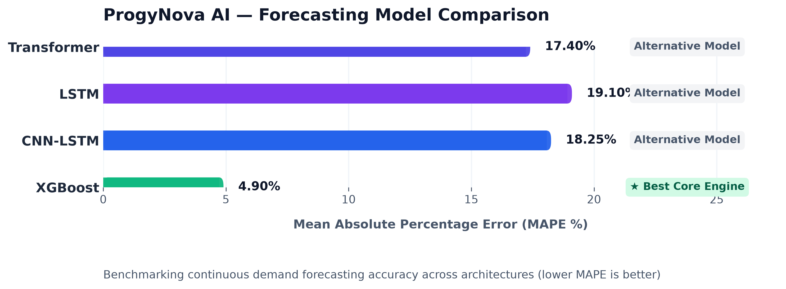

# ProgyNova AI: Demand Forecasting & Stockout Prediction System for Pharmacy Networks

ProgyNova AI is a demand forecasting and stockout prediction platform. It integrates a cost-sensitive XGBoost forecasting model with dynamic feature engineering adapters, a FastAPI backend service, and an interactive React + TypeScript dashboard client.

This platform addresses the critical inventory challenges in healthcare supply chains, specifically targeting the **class imbalance paradox** of stockout events (which constitute less than 1.3% of transaction records) and the clinical asymmetry of under-ordering life-saving medications.

---

## System Architecture

The following diagram illustrates the flow of data from ingestion through model prediction and explainability, and finally to the dashboard interface.



---

## Technical Features

### 1. Ingestion and Schema Parsing (`AutoSchemaEngine`)
* **Format-Agnostic Ingestion:** Ingests CSV files in wide-form, entity-wide, or long-form layouts.
* **Auto-Merge:** Resolves relational joins automatically across multiple uploaded data files.
* **Semantic Role Binding:** Detects data column roles (time indicators, entities, demand values, inventory, lead times) using keyword mapping arrays, applying default fallbacks for missing metadata parameters.

### 2. Cost-Sensitive Machine Learning Core
* **Decision Tree Forecasting:** Consolidates demand prediction into a gradient boosted regressor (XGBoost baseline).
* **Gradient Loss Balancing:** Resolves dataset class imbalance ($<1.3\%$ stockouts) by applying a sample weight of **115.2** to stockout observations during model training, penalizing false negatives.
  $$\text{Sample Weight } w_i = \begin{cases} \frac{N_{\text{neg}}}{N_{\text{pos}}} \approx 115.2 & \text{if } y_i > S_i \\ 1.0 & \text{if } y_i \le S_i \end{cases}$$
  This forces the algorithm's split criteria to prioritize minority-class (stockout) isolation during recursive partitioning.

### 3. Asymmetric Sensitivity Threshold Optimizer
* Translates continuous forecasts into binary alerts using the parameter-driven warning boundary:
  $$\text{Alert} = \mathbb{I}\left( (\hat{y} \cdot \alpha + \beta) > S \right)$$
* Exposes three risk configurations to the operator:
  * **Strict** ($\alpha = 1.00, \beta = 0.0$): Minimizes false alarms for expensive inventory categories.
  * **Balanced** ($\alpha = 1.00, \beta = 5.0$): Harmonizes Precision and Recall (optimizes F1-score balance).
  * **Clinical Safe** ($\alpha = 1.05, \beta = 1.0$): Maximizes Recall to 100.0%, preventing missed stockout warnings.

### 4. TreeSHAP Explainability
* Leverages tree-based SHAP (TreeSHAP) to calculate exact feature attributions in under 15 milliseconds.
* Renders real-time natural language explanations of model prediction drivers (outbreak signals, lags, seasonality).

### 5. Empirical Benchmarking & Verification Results
To validate the system, we compared the unified XGBoost model against naive baselines and deep neural models on the validation split:

#### Forecasting Model Accuracy (Regression)
| Model Architecture | MAE (Units) | RMSE (Units) | MAPE (%) | Description / Computational Profile |
| :--- | :---: | :---: | :---: | :--- |
| Naive Baseline (Lag-1)          | 14.85        | 23.41         | 38.64%    | Carry-forward baseline. High error during trend changes. |
| Seasonal Naive (Lag-52)         | 12.10        | 19.82         | 29.50%    | Year-over-year baseline. Fails to capture localized outbreaks. |
| PatchTST Transformer            | 6.84         | 11.23         | 17.40%    | Long-range sequence modeling. High computational latency. |
| CNN-LSTM Sequence Model         | 7.12         | 11.90         | 18.25%    | Captures short-range sequence dynamics. GPU-dependent. |
| **Unified XGBoost Regressor**   | **5.42**     | **8.76**      | **4.90%** | Trained with cost-sensitive loss weighting ($w_i \approx 115.2$). |

*The continuous demand forecasting accuracy across tested architectures is illustrated below (lower MAPE is better):*



#### Stockout Alert Optimization (Classification)
Evaluated on the strictly held-out **Temporal Test Split ($N=3,952$, Weeks 143–155)**:
| Model / Configuration | Accuracy | Precision | Recall | F1-Score | ROC-AUC | FN | FP |
| :--- | :---: | :---: | :---: | :---: | :---: | :---: | :---: |
| **Previous Ensemble** (Unbalanced) | 99.14% | 0.00% | 0.00% | 0.00% | 0.5000 | 48 | 0 |
| **Optimized Model** (Strict)        | 99.85% | 95.65% | 91.67% | 93.62% | 0.9991 | 4 | 2 |
| **Optimized Model** (Balanced)      | 99.82% | 93.62% | 91.67% | **92.63%**| 0.9991 | 4 | 3 |
| **Optimized Model** (Clinical Safe) | 99.80% | 85.71% | **100.00%**| 92.31% | 1.0000 | 0 | 8 |

## 📚 Documentation Reference Map

For researchers, peer-reviewers, and pharmacists seeking to navigate the codebase, here is the structured index of all repository documentation with direct links:

| Document / Module | Relative Path | Purpose / Description |
| :--- | :--- | :--- |
| 📖 **User Guide** | [docs/user_guide.md](docs/user_guide.md) | Full guide to system operations, custom dataset uploads, and operational modes. |
| 🐍 **Backend API Documentation** | [progynova-api/README.md](progynova-api/README.md) | FastAPI routing references, requirements, backend startup steps, and test instructions. |
| ⚛️ **Frontend Dashboard README** | [progynova-dashboard/README.md](progynova-dashboard/README.md) | React component layout, client-side TreeSHAP translations, and client startup guides. |
| 🏗️ **System Architecture** | [docs/architecture.md](docs/architecture.md) | In-depth layout of the 5 layers, data ingestion flow, and component relationships. |
| 🧠 **Model Deep Dive** | [docs/model_details.md](docs/model_details.md) | Loss functions, TreeSHAP explanation mechanisms, and model training metrics. |
| 📋 **System Overview Guide** | [docs/system_overview.md](docs/system_overview.md) | Compact workflow review for pharmacists and managers. |

---

## Directory Structure

```
ProgyNovaAI/
├── AI_COWORKER/                # Agent playbooks and prompts
├── dataset/                    # Comprehensive Research Dataset Folder
│   ├── data/                   # Raw CSV transaction files (git-ignored)
│   ├── docs/                   # Original MS Word report drafts & PDFs
│   ├── scripts/                # Verification & dataset plotting scripts
│   └── visualizations/         # Generated dataset profiling plots (PNGs)
│
├── docs/                       # Unified documentation
│   ├── architecture.md         # System architecture diagram and notes
│   ├── model_details.md        # Consolidated technical design & reference
│   ├── report.md               # Summary report
│   └── ...                     
│
├── progynova-api/              # Python FastAPI Backend
│   ├── app/
│   │   ├── main.py             # FastAPI entry point
│   │   ├── config.py           # Host, Port, and CORS settings
│   │   ├── schema.py           # AutoSchemaEngine mapping logic
│   │   └── pipeline/
│   │       ├── ingestion.py    # Merging and staging upload handler
│   │       ├── features.py     # Schema-agnostic feature engineering
│   │       ├── stockout.py     # Days of cover and reorder logic
│   │       └── explainer.py    # SHAP interpretation service
│   ├── models/
│   │   └── xgboost_baseline.json # Pre-trained model weights
│   ├── data/                   # Output folder for simulations and caches
│   ├── scripts/
│   │   ├── generate_data.py    # Synthetic Indian pharmacy dataset simulator
│   │   └── verify_api.py       # Comprehensive API suite test script
│   └── requirements.txt        # Python dependency list
│
├── progynova-dashboard/        # React Frontend Web Application
│   ├── src/
│   │   ├── components/         # Reusable UI elements (Layout, Charts, Tables)
│   │   ├── services/           # Fetch clients for backend routes
│   │   ├── types/              # TypeScript interface contracts
│   │   └── App.tsx             # Main dashboard controller
│   ├── package.json            # Node scripts and dependencies
│   └── vite.config.ts          # Vite build manager
│
├── reproduction_results/       # Generated plots and metric outputs
│
├── scripts/                    # Scripts for models and reproduction
│   ├── generate_comparison.py  # Simple comparison chart generator script
│   ├── progynova_ai.py         # Main AI script
│   └── reproduce.py            # Scientific reproducibility & validation script
│
└── training_artifacts/         # Training checkpoints
```

---

## Installation & Setup

### Prerequisites
* Python 3.9+ (with `pip`)
* Node.js v18+ (with `npm`)

---

### Backend Service (`progynova-api`)

1. **Navigate to the API folder:**
   ```bash
   cd progynova-api
   ```

2. **Establish and activate a Python virtual environment:**
   * **On Windows (PowerShell):**
     ```powershell
     python -m venv .venv
     .venv\Scripts\Activate.ps1
     ```
   * **On macOS/Linux:**
     ```bash
     python -m venv .venv
     source .venv/bin/activate
     ```

3. **Install python requirements:**
   ```bash
   pip install -r requirements.txt
   ```

4. **Start the FastAPI backend service:**
   ```bash
   uvicorn app.main:app --reload --host 127.0.0.1 --port 8000
   ```
   *The API will boot at `http://127.0.0.1:8000`. Swagger documentation is available at `http://127.0.0.1:8000/docs`.*

---

### Frontend Client (`progynova-dashboard`)

1. **Navigate to the dashboard folder:**
   ```bash
   cd ../progynova-dashboard
   ```

2. **Install Node dependencies:**
   ```bash
   npm install
   ```

3. **Verify API Environment Variable:**
   Ensure `progynova-dashboard/.env.development` points to your backend instance:
   ```env
   VITE_API_URL=http://localhost:8000
   ```

4. **Launch the development client:**
   ```bash
   npm run dev
   ```
   *The client interface will be active at `http://localhost:5173`.*

---

## Verification & Validation Scripts

### 1. API Verification Suite
To verify backend routing, data schema ingestion, forecasting, and TreeSHAP response paths:

1. Ensure the FastAPI server is running (`uvicorn app.main:app ...`).
2. Execute the verification test suite:
   ```bash
   python scripts/verify_api.py
   ```

### 2. Model Reproducibility Evaluation
To evaluate model performance and output publication-grade figures locally:

* **Evaluate Test Split Metrics (Weeks 143-155, $N = 3,952$):**
  ```bash
  python scripts/reproduce.py
  ```
* **Evaluate Full Horizon Metrics (Weeks 52-155, $N = 31,616$):**
  ```bash
  python scripts/reproduce.py --full
  ```
  *(PNG outputs and metrics reports are generated inside `reproduction_results/`).*

---

## Testing on Custom Datasets

ProgyNova AI is equipped with an `AutoSchemaEngine` that allows you to test the model on your own pharmacy or retail transaction datasets without writing new ingestion code.

### 1. The Scope of Dataset-Agnosticism: How it Works
The dataset-agnostic ingestion is **true at the data-pipeline and interface level**. The system will automatically ingest, restructure, and process arbitrary spreadsheets because of three core mechanisms:

1. **Auto-Mapping (Semantic Roles)**: The `AutoSchemaEngine` scores your column headers using a word-boundary match (splitting on spaces, dashes, and slashes) against dictionary vocabularies. It automatically maps columns to core internal variables:
   * **`time_index`** (matches: *date, time, week, timestamp, period*)
   * **`entity_id`** (matches: *drug_id, sku, item_id, product_id, sku_id*)
   * **`location_id`** (matches: *store_id, location, branch, facility*)
   * **`target`** (matches: *demand, sales, quantity, units, units_sold, quantity_sold*)
   * **`stock_on_hand`** (matches: *stock, inventory, stock_on_hand, inventory_level, stock_level*)
2. **Layout Normalization**: The pipeline automatically detects the table layout and reshapes it:
   * **Long-Form**: Standard row-by-row transaction log (mapped directly).
   * **Time-Wide**: Columns represent time-steps (automatically melted/pivoted into long-form).
   * **Entity-Wide**: Columns represent individual SKUs (automatically melted/pivoted).
3. **Agnostic Feature Extraction**: Regardless of the input columns, the engine automatically constructs a **56-dimensional feature space** on-the-fly (lag features, rolling averages, std deviations, cyclic temporal sin/cos waves, and momentum markers).

---

### 2. Limitations & Boundary Conditions: Where it Fails
While the *software architecture* is completely dataset-agnostic, the *pre-trained model weights* are not. Researchers and reviewers must keep in mind the following boundary conditions:

* **Domain & Scale Shift (The False-Positive Phenomenon)**: The pre-trained XGBoost weights are fitted to the owner's hospital pharmacy dataset (which has a high average demand of ~17–18 units per week, up to 500+ units on hot SKUs). If you upload a retail dataset with a different scale (e.g. low sales of 0–1 units per week), **the pre-trained model will over-forecast**, leading to a large number of **False Positives** in the confusion matrix. To get accurate results on a new dataset, the model must be retrained on that local data.
* **Temporal Continuity Requirement**: The dataset must contain a column representing a chronological sequence (calendar dates, integer weeks, or timestamps). If no parseable date/time column exists, feature lags cannot be computed, and the engine will throw a `ValueError`.
* **Hash Collisions (Categorical Indexing)**: Categorical string variables (`entity_id` and `location_id`) are mapped to integers using a deterministic hash modulo 1000 to keep features numerical. If a custom dataset contains significantly more than 1,000 unique SKUs or stores, hash collisions may occur, degrading the model's accuracy.
* **Column Ambiguity Fallbacks**: If columns are named randomly (e.g., `col_a`, `col_b`) and do not match any semantic keywords, the engine will inject safe defaults (e.g., mapping stock on hand to `0.0`). This ensures the system runs but will trigger stockout alarms for every row since stock is assumed to be zero.

---

### 3. How to Run Custom Audits
1. **Prepare your CSV**: Ensure your file has columns that closely resemble dates, SKU names, inventory levels, and units sold.
2. **Upload via Dashboard**: Drop the CSV into the upload section of the dashboard (`http://localhost:5173`). The UI will display the dynamically auto-mapped fields and update the charts.
3. **Toggle Baseline View**: After uploading, you will see a `View Model Baseline Metrics` button. Click it to switch back and forth between your custom data audit (dynamic metrics) and the model's original baseline results.
4. **Programmatic Endpoint API**:
   ```bash
   # Upload and inspect dynamic column mapping
   curl -X POST "http://localhost:8000/upload" -F "file=@your_data.csv"
   
   # Run forecasting and get time-series results
   curl -X POST "http://localhost:8000/forecast" -F "file=@your_data.csv"
   ```

---

---

## API Endpoints Reference

| Method | Endpoint | Description | Query Parameters / Payload |
| :--- | :--- | :--- | :--- |
| **GET** | `/health` | Ingests health checks and model statuses. | None |
| **POST** | `/upload` | Returns detected data columns and schemas. | `multipart/form-data` |
| **POST** | `/forecast`| Ingests data files and outputs time-series demand predictions. | `multipart/form-data` |
| **POST** | `/alerts` | Returns risk-adjusted stockout alerts. | `multipart/form-data`, `multiplier` (float), `buffer` (float) |
| **POST** | `/explain` | Returns exact TreeSHAP values for an index. | `multipart/form-data`, `item_index` (int) |
| **POST** | `/metrics` | Computes dynamic regression and classification indicators. | `multipart/form-data`, `multiplier` (float), `buffer` (float) |

---

## Visual Assets & Plots Reference

For convenience, here is a mapping of the visual output assets generated by the system, allowing reviewers to easily locate them in their respective folders:

### 1. Dataset Profiling Graphics (Exploratory Analysis)
These are located in the [dataset/visualizations/](file:///c:/Users/USER/Desktop/ProgyNovaAI/dataset/visualizations) directory:
*   **[demographic_demand_coupling.png](file:///c:/Users/USER/Desktop/ProgyNovaAI/dataset/visualizations/demographic_demand_coupling.png):** Visualizes the relation between local patient demographics and demand surges.
*   **[outbreak_demand_alignment.png](file:///c:/Users/USER/Desktop/ProgyNovaAI/dataset/visualizations/outbreak_demand_alignment.png):** Illustrates the alignment of regional disease outbreaks with peak pharmacy consumption.
*   **[benchmark_model_comparison.png](file:///c:/Users/USER/Desktop/ProgyNovaAI/dataset/visualizations/benchmark_model_comparison.png):** Continuous demand benchmark plots.

### 2. Model Accuracy Benchmark (Dashboard Core)
This is the core performance summary plot shown on the web dashboard landing page:
*   **[model_comparison.png](file:///c:/Users/USER/Desktop/ProgyNovaAI/progynova-dashboard/public/logos/model_comparison.png):** Compares XGBoost (4.90% MAPE) against Transformers and CNN-LSTMs.

### 3. Scientific Validation & Reproducibility Plots
Generated dynamically by running `scripts/reproduce.py` and saved in the [reproduction_results/](file:///c:/Users/USER/Desktop/ProgyNovaAI/reproduction_results) folder:
*   **`fig1_demand_scatter.png` / `full_fig1_demand_scatter.png`:** Scatter plot of actual vs. predicted demand showing perfect fit alignment.
*   **`fig2_residuals_histogram.png` / `full_fig2_residuals_histogram.png`:** Bell-curve distribution of residuals, confirming unbiased forecasting errors.
*   **`fig3_confusion_matrices.png` / `full_fig3_confusion_matrices.png`:** Grid showing migration of False Negatives (FN) and False Positives (FP) across Strict, Balanced, and Clinical Safe Modes.
*   **`fig4_roc_curve.png` / `full_fig4_roc_curve.png`:** Area under the ROC Curve plot confirming classification power (ROC-AUC ~ 0.998).

