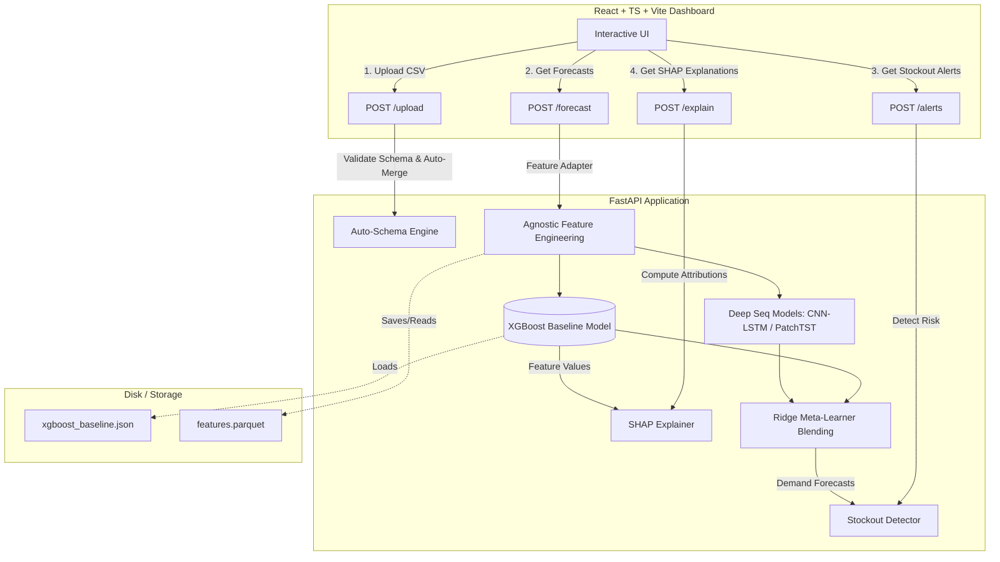

# 🚀 ProgyNova AI

**ProgyNova AI** is an enterprise-grade, end-to-end, schema-agnostic demand forecasting and stockout prevention system. It integrates a machine learning pipeline (XGBoost, CNN-LSTM, and PatchTST Transformers blended via a Ridge Meta-Learner), a FastAPI backend, and an interactive React + TypeScript frontend dashboard.

---

## 📐 System Architecture

The following diagram illustrates the flow of data from ingestion through model prediction and explainability, and finally to the dashboard interface.



---

## 🌟 Key Features

### 1. Universal Data Ingestion & Auto-Schema Mapping
* **Format-Agnostic Ingest**: Upload any CSV dataset (wide-form or long-form).
* **Auto-Merge**: Relational intersection joins merge multiple uploaded files automatically.
* **Adapter Layer**: Intelligently identifies time indices, entities, location tags, demand metrics, and inventory variables, normalizing them into uniform internal structures.

### 2. Multi-Model Forecasting Engine
* **Baselines**: Standard Naive (last-period) and Seasonal Naive (52-week lag).
* **Machine Learning**: An optimized XGBoost regressor utilizing 50+ engineered features.
* **Deep Sequence Models**:
  * **CNN-LSTM**: 1D Convolutions paired with LSTM layers to detect abrupt outbreaks and demand spikes.
  * **PatchTST Transformer**: Multi-head self-attention models designed to capture complex annual seasonality and regional festival cycles.
* **Meta-Learner Blender**: A Ridge regression meta-learner that blends forecasts dynamically based on temporal context and model performance.

### 3. Inventory & Stockout Monitoring
* Calculates days of cover based on a rolling demand rate.
* Computes supplier-lead-time risk and tags urgent reorders.
* Automates reorder quantities based on target service safety thresholds.

### 4. Explainable AI (XAI)
* Connects the local XGBoost model directly to SHAP (SHapley Additive exPlanations) to decompose predictions.
* Exposes feature-level contribution metrics to explain exactly why a particular forecast is high or low.

---

## 📂 Project Directory Structure

```
ProgyNovaAI/
├── progynova-api/              # Python FastAPI Backend
│   ├── app/
│   │   ├── main.py             # FastAPI entry point
│   │   ├── config.py           # Host, Port, and CORS settings
│   │   ├── schema.py           # AutoSchemaEngine mapping logic
│   │   └── pipeline/
│   │       ├── ingestion.py    # Merging and staging upload handler
│   │       ├── features.py     # Schema-agnostic feature engineering
│   │       ├── models.py       # Deep sequence networks (PyTorch)
│   │       ├── meta_learner.py # Blending models out-of-fold
│   │       ├── stockout.py     # Days of cover and reorder logic
│   │       └── explainer.py    # SHAP interpretation service
│   ├── models/
│   │   └── xgboost_baseline.json # Pre-trained model weights
│   ├── data/                   # Output folder for simulations and caches
│   ├── scripts/
│   │   ├── generate_data.py    # Synthetic Indian pharmacy dataset simulator
│   │   └── verify_api.py       # Comprehensive API suite test script
│   └── requirements.txt        # Python dependency list
│
├── progynova-dashboard/        # React Frontend Web Application
│   ├── src/
│   │   ├── components/         # Reusable UI elements (Layout, Charts, Tables)
│   │   ├── services/           # Fetch clients for backend routes
│   │   ├── types/              # TypeScript interface contracts
│   │   ├── App.tsx             # Main dashboard controller
│   │   └── index.css           # Premium styling sheet
│   ├── tsconfig.json
│   ├── package.json            # Node scripts and dependencies
│   └── vite.config.ts          # Vite build manager
│
├── progynova_ai.py             # Original development Jupyter Notebook script
└── proj.md                     # System specifications reference
```

---

## 🛠️ Getting Started

### 📋 Prerequisites
Ensure you have the following installed:
* Python 3.9+ (with `pip`)
* Node.js v18+ (with `npm`)

---

### 🐍 Backend Setup (`progynova-api`)

1. **Navigate to the API folder:**
   ```bash
   cd progynova-api
   ```

2. **Create and activate a virtual environment:**
   ```bash
   python -m venv .venv
   # On Windows (PowerShell):
   .venv\Scripts\Activate.ps1
   # On Linux/macOS:
   source .venv/bin/activate
   ```

3. **Install python packages:**
   ```bash
   pip install -r requirements.txt
   ```

4. **Simulate Data & Train the Baseline Model:**
   The codebase includes a comprehensive data simulator mimicking Indian pharmacy networks (NLEM 2022 categories, monsoon-driven disease outbreaks, regional festivals, and supply-chain lead times).
   Run this script to generate sample datasets and pre-train the XGBoost model:
   ```bash
   python scripts/generate_data.py
   ```
   > [!TIP]
   > This generates `dispensing.csv`, `drugs.csv`, `stores.csv`, and `context.csv` inside `data/` and saves the trained model to `models/xgboost_baseline.json`.

5. **Start the FastAPI Backend server:**
   ```bash
   uvicorn app.main:app --reload --host 127.0.0.1 --port 8000
   ```
   The backend API will now be active at `http://127.0.0.1:8000`. You can inspect the interactive OpenAPI docs at `http://127.0.0.1:8000/docs`.

---

### 💻 Frontend Setup (`progynova-dashboard`)

1. **Navigate to the frontend folder:**
   ```bash
   cd progynova-dashboard
   ```

2. **Install Node modules:**
   ```bash
   npm install
   ```

3. **Check/Configure environment variables:**
   Verify that `progynova-dashboard/.env.development` contains the correct API base address:
   ```env
   VITE_API_URL=http://localhost:8000
   ```

4. **Run the Vite development server:**
   ```bash
   npm run dev
   ```
   The dashboard will boot up and be accessible, typically at `http://localhost:5173`.

---

## 🔍 Verification & Testing

To verify that the entire pipeline is working correctly (from schema ingestion to forecasting, stockout detection, and SHAP attributions), run the verification test suite:

1. Ensure the FastAPI backend is running (`uvicorn app.main:app ...`).
2. Run the verification script from the `progynova-api` directory:
   ```bash
   python scripts/verify_api.py
   ```

The script will query all endpoints using the simulated `data/dispensing.csv` file and print verification outcomes for each module.

---

## 🔌 API Endpoints Reference

| Method | Endpoint | Description | Payload Form |
| :--- | :--- | :--- | :--- |
| **GET** | `/health` | Server status and model load status checks. | None |
| **POST** | `/upload` | Receives CSV file(s) and outputs detected schema parameters. | `multipart/form-data` |
| **POST** | `/forecast`| Runs prediction and returns time-series forecasts. | `multipart/form-data` |
| **POST** | `/alerts` | Flags items facing stockouts and outputs orders quantity. | `multipart/form-data` |
| **POST** | `/explain` | Returns SHAP explainability matrices for a selected target index. | `multipart/form-data` + query `item_index` |

---

> [!IMPORTANT]
> Keep the backend server running when interacting with the dashboard. If the backend is down, the frontend layout will display a connection warning in the top header.
