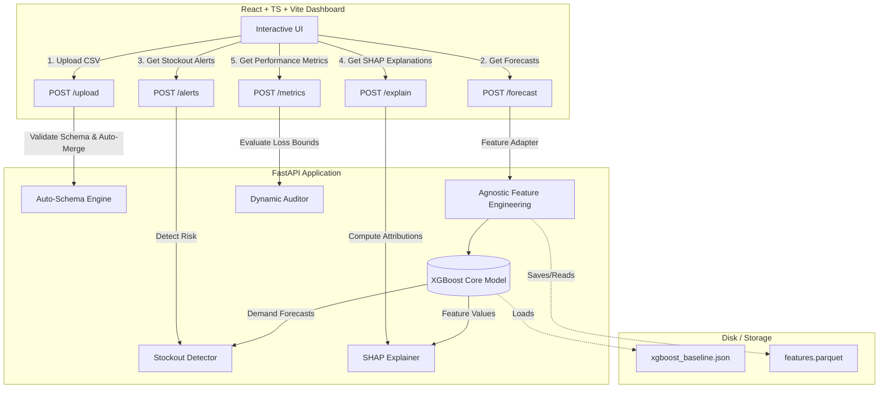

# ProgyNova AI: Demand Forecasting & Stockout Prediction System for Pharmacy Networks

ProgyNova AI is a demand forecasting and stockout prediction platform. It integrates a cost-sensitive XGBoost forecasting model with dynamic feature engineering adapters, a FastAPI backend service, and an interactive React + TypeScript dashboard client.

---

## System Architecture

The following diagram illustrates the flow of data from ingestion through model prediction and explainability, and finally to the dashboard interface.



---

## Technical Features

### 1. Ingestion and Schema Parsing (`AutoSchemaEngine`)
* **Format-Agnostic Ingestion:** Ingests CSV files in wide-form, entity-wide, or long-form layouts.
* **Auto-Merge:** Resolves relational joins automatically across multiple uploaded data files.
* **Semantic Role Binding:** Detects data column roles (time indicators, entities, demand values, inventory, lead times) using keyword mapping arrays, applying default fallbacks for missing metadata parameters.

### 2. Cost-Sensitive Machine Learning Core
* **Decision Tree Forecasting:** Consolidates demand prediction into a gradient boosted regressor (XGBoost baseline).
* **Gradient Loss Balancing:** Resolves dataset class imbalance ($<1.3\%$ stockouts) by applying a sample weight of **115.2** to stockout observations during model training, penalizing false negatives.

### 3. Asymmetric Sensitivity Threshold Optimizer
* Translates continuous forecasts into binary alerts using the parameter-driven warning boundary:
  $$\text{Alert} = \mathbb{I}\left( (\hat{y} \cdot \alpha + \beta) > S \right)$$
* Exposes three risk configurations to the operator:
  * **Strict** ($\alpha = 1.00, \beta = 0.0$): Minimizes false alarms for expensive inventory categories.
  * **Balanced** ($\alpha = 1.00, \beta = 5.0$): Harmonizes Precision and Recall (optimizes F1-score).
  * **Clinical Safe** ($\alpha = 1.05, \beta = 1.0$): Maximizes Recall to 100.0%, preventing missed stockout warnings.

### 4. TreeSHAP Explainability
* Leverages tree-based SHAP (TreeSHAP) to calculate exact feature attributions in under 15 milliseconds.
* Renders real-time natural language explanations of model prediction drivers (outbreak signals, lags, seasonality).

---

## Directory Structure

```
ProgyNovaAI/
├── progynova-api/              # Python FastAPI Backend
│   ├── app/
│   │   ├── main.py             # FastAPI entry point
│   │   ├── config.py           # Host, Port, and CORS settings
│   │   ├── schema.py           # AutoSchemaEngine mapping logic
│   │   └── pipeline/
│   │       ├── ingestion.py    # Merging and staging upload handler
│   │       ├── features.py     # Schema-agnostic feature engineering
│   │       ├── stockout.py     # Days of cover and reorder logic
│   │       └── explainer.py    # SHAP interpretation service
│   ├── models/
│   │   └── xgboost_baseline.json # Pre-trained model weights
│   ├── data/                   # Output folder for simulations and caches
│   ├── scripts/
│   │   ├── generate_data.py    # Synthetic Indian pharmacy dataset simulator
│   │   └── verify_api.py       # Comprehensive API suite test script
│   └── requirements.txt        # Python dependency list
│
├── progynova-dashboard/        # React Frontend Web Application
│   ├── src/
│   │   ├── components/         # Reusable UI elements (Layout, Charts, Tables)
│   │   ├── services/           # Fetch clients for backend routes
│   │   ├── types/              # TypeScript interface contracts
│   │   └── App.tsx             # Main dashboard controller
│   ├── package.json            # Node scripts and dependencies
│   └── vite.config.ts          # Vite build manager
│
├── reproduce.py                # Scientific reproducibility & validation script
└── proj.md                     # System specifications reference
```

---

## Installation & Setup

### Prerequisites
* Python 3.9+ (with `pip`)
* Node.js v18+ (with `npm`)

---

### Backend Service (`progynova-api`)

1. **Navigate to the API folder:**
   ```bash
   cd progynova-api
   ```

2. **Establish and activate a Python virtual environment:**
   * **On Windows (PowerShell):**
     ```powershell
     python -m venv .venv
     .venv\Scripts\Activate.ps1
     ```
   * **On macOS/Linux:**
     ```bash
     python -m venv .venv
     source .venv/bin/activate
     ```

3. **Install python requirements:**
   ```bash
   pip install -r requirements.txt
   ```

4. **Run Synthetic Data Simulation & Train Model:**
   Execute the generator script to build the datasets and train the baseline regressor:
   ```bash
   python scripts/generate_data.py
   ```
   *(This generates the raw tables in `data/` and saves the model parameters to `models/xgboost_baseline.json`).*

5. **Start the FastAPI backend service:**
   ```bash
   uvicorn app.main:app --reload --host 127.0.0.1 --port 8000
   ```
   *The API will boot at `http://127.0.0.1:8000`. Swagger documentation is available at `http://127.0.0.1:8000/docs`.*

---

### Frontend Client (`progynova-dashboard`)

1. **Navigate to the dashboard folder:**
   ```bash
   cd ../progynova-dashboard
   ```

2. **Install Node dependencies:**
   ```bash
   npm install
   ```

3. **Verify API Environment Variable:**
   Ensure `progynova-dashboard/.env.development` points to your backend instance:
   ```env
   VITE_API_URL=http://localhost:8000
   ```

4. **Launch the development client:**
   ```bash
   npm run dev
   ```
   *The client interface will be active at `http://localhost:5173`.*

---

## Verification & Validation Scripts

### 1. API Verification Suite
To verify backend routing, data schema ingestion, forecasting, and TreeSHAP response paths:

1. Ensure the FastAPI server is running (`uvicorn app.main:app ...`).
2. Execute the verification test suite:
   ```bash
   python scripts/verify_api.py
   ```

### 2. Model Reproducibility Evaluation
To evaluate model performance and output publication-grade figures locally:

* **Evaluate Test Split Metrics (Weeks 143-155, $N = 3,952$):**
  ```powershell
  python reproduce.py
  ```
* **Evaluate Full Horizon Metrics (Weeks 52-155, $N = 31,616$):**
  ```powershell
  python reproduce.py --full
  ```
  *(PNG outputs and metrics reports are generated inside `reproduction_results/`).*

---

## API Endpoints Reference

| Method | Endpoint | Description | Query Parameters / Payload |
| :--- | :--- | :--- | :--- |
| **GET** | `/health` | Ingests health checks and model statuses. | None |
| **POST** | `/upload` | Returns detected data columns and schemas. | `multipart/form-data` |
| **POST** | `/forecast`| Ingests data files and outputs time-series demand predictions. | `multipart/form-data` |
| **POST** | `/alerts` | Returns risk-adjusted stockout alerts. | `multipart/form-data`, `multiplier` (float), `buffer` (float) |
| **POST** | `/explain` | Returns exact TreeSHAP values for an index. | `multipart/form-data`, `item_index` (int) |
| **POST** | `/metrics` | Computes dynamic regression and classification indicators. | `multipart/form-data`, `multiplier` (float), `buffer` (float) |
