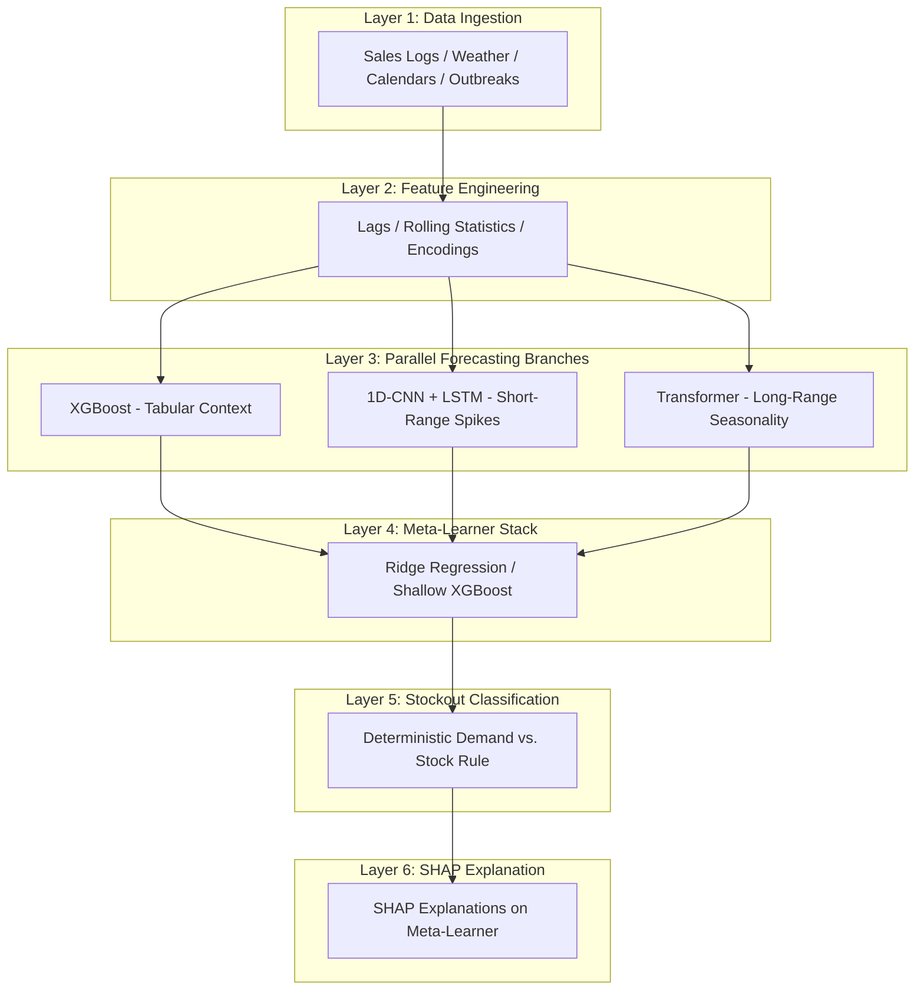
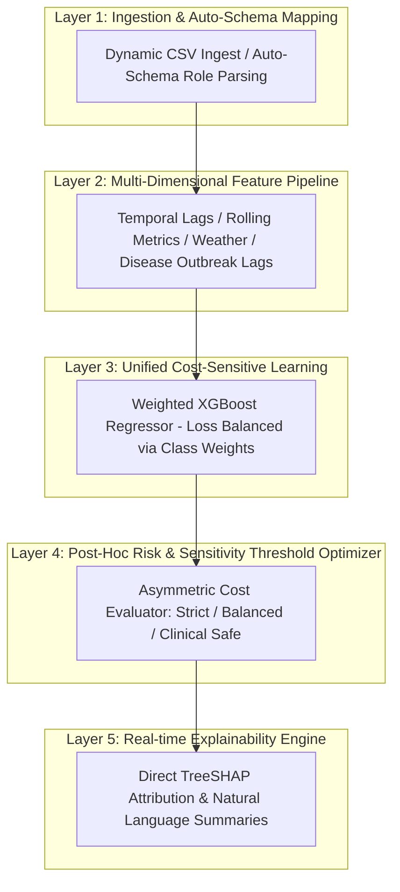

# ProgyNovaAI: Evolution of a Robust Pharmaceutical Demand Forecasting & Stockout Prediction Architecture

This document provides a comprehensive, publication-grade description of the ProgyNovaAI system architecture. It outlines the design choices, mathematical foundations, and operational changes that transitioned the system from an initial multi-branch ensemble model to the current cost-sensitive, threshold-optimized framework.

---

## 1. Architectural Overview

Predicting pharmaceutical stockouts in pharmacy networks is a highly challenging task characterized by two distinct data properties:
1. **Multimodal Information**: Demand patterns are driven by a mixture of tabular context (supplier lead times, catchment population, category) and temporal dynamics (historical sales, monsoon seasonality, regional festival demand, and lagging disease outbreaks).
2. **Extreme Class Imbalance**: In real-world pharmacy logs, stockout shortages are rare events—occurring in less than 1% of product-location-week observations. Standard machine learning models trained on such data tend to overfit to the majority class (predicting "No Stockout" everywhere), achieving misleadingly high accuracy (e.g., 99%) while missing critical stockouts.

To address these challenges, the system evolved from a **conceptual multi-branch stacked ensemble** to a **unified Cost-Sensitive Regressor with Post-Hoc Sensitivity Optimization**.

---

## 2. Comparison of System Pipelines

### Previous Architecture (Conceptual Multi-Branch Stacked Ensemble)

### Updated Architecture (Production Cost-Sensitive Optimized Framework)

---

## 3. Detailed Component Breakdown

### 3.1 Layer 1: Data Ingestion & Auto-Schema Mapping

* **Previous Design**: Loaded static files sequentially. The system assumed a fixed format and struggled to adapt to custom columns or missing fields, requiring manual restructuring of datasets.
* **Updated Design**: Implemented the `AutoSchemaEngine`. It performs semantic profile scoring using keyword search arrays (`TIME_KW`, `STOCK_KW`, `LEAD_KW`, `ENTITY_ID_KW`, etc.) to auto-detect data layouts (e.g., *time-wide*, *entity-wide*, or *long-form*). It maps custom data columns dynamically, injects defaults for missing operational parameters (e.g., fallback lead time of 1.0 week), and merges auxiliary tables (`drugs.csv`, `stores.csv`, `context.csv`) on matching identifiers (`drug_id`, `store_id`, `region`, `week`) to create a unified data matrix.

---

### 3.2 Layer 2: Feature Engineering

* **Previous Design**: Features were hardcoded with a fixed structure. Any missing contextual columns (such as disease severities or rainfall anomalies) would cause NaN errors or pipeline crashes.
* **Updated Design**: Formulated a robust pipeline that dynamically handles missing columns. Key engineered features include:
  1. **Historical Demand Lags**: Captures consumption history across weeks $t-1, t-2, t-4, t-8, t-12, t-26, t-52$.
  2. **Rolling Statistics**: Captures 4-week, 8-week, and 12-week rolling averages and standard deviations of demand.
  3. **Cyclical Calendar Encodings**: Transforms calendar periods using sine and cosine functions:
     $$\text{sin\_week} = \sin\left(\frac{2\pi \cdot \text{week\_of\_year}}{52}\right), \quad \text{cos\_week} = \cos\left(\frac{2\pi \cdot \text{week\_of\_year}}{52}\right)$$
  4. **Dynamic Outbreak Lags**: If regional disease columns (`sev_dengue`, `sev_malaria`, etc.) are present, the pipeline dynamically computes lag features ($t-0, t-1, t-2$) for 8 specific epidemic-prone diseases. It also calculates aggregate outbreak indicators (`outbreak_any_active` and `outbreak_count`) based on a severity threshold ($> 0.3$).
  5. **Label Encodings**: Automatically maps `region`, `category`, and `monsoon_phase` to standardized indices based on training configurations to prevent feature signature mismatch.

---

### 3.3 Layer 3: Model Architecture & Forecasting Core

#### Previous: The Multi-Branch Stacked Ensemble
The conceptual system split the prediction task into three parallel deep learning and machine learning branches:
1. **XGBoost (Tabular Branch)**:
   * *Role*: Processed static metadata (e.g., store population, supplier lead times, category) that sequence models could not represent.
   * *Hyperparameters*: Max depth 6, learning rate 0.05, 500 estimators, subsample 0.8.
2. **1D-CNN + LSTM (Short-Range Sequence Branch)**:
   * *Role*: Processed a 52-week sliding window of demand. A 1D convolutional layer (64 filters, kernel size 7) extracted local temporal features (short-term spikes, momentum) and fed an LSTM (128 units) to capture medium-range trends.
3. **PatchTST Transformer Encoder (Long-Range Sequence Branch)**:
   * *Role*: Learns annual seasonality and multi-year trends. It segmented the sequence into 4-week patches, projected them to a 64-dimensional vector space, added positional embeddings, and passed them through a 4-layer, 4-head self-attention module.
4. **Meta-Learner Stack**:
   * *Role*: A Ridge regression or shallow XGBoost model trained via 5-fold cross-validation on out-of-fold predictions. It learned to weight the branches dynamically (e.g., trusting the Transformer during seasonal shifts and XGBoost during stable periods).

#### Updated: Unified Cost-Sensitive XGBoost Regressor
While the ensemble design was theoretically appealing, it suffered from severe drawbacks in practice:
* **Overfitting on Class Imbalance**: The meta-learner and sequence branches had high capacity but lacked built-in mechanisms to handle the $<1\%$ stockout rate. The models simply predicted normal seasonal demand, missing critical deficit spikes.
* **Compute & Latency Overhead**: Running deep learning models (CNN-LSTM, Transformer) in parallel with an XGBoost regressor required GPUs, created heavy memory footprints, and introduced excessive latency during batch uploads.
* **Feature Incoherency**: Incomplete historical sequences (e.g., new store openings or short logs) caused the deep learning sequence branches to crash due to missing patches.

The system was redesigned to use a **Unified XGBoost Regressor ($N_{\text{estimators}} = 500, \text{Max Depth} = 6$)** trained using **Cost-Sensitive Loss Balancing**.

##### Mathematical Formulation of Loss Balancing
To prevent the model from ignoring rare stockout events, we calculate sample weights during the training phase. For each training sample $i$, the target variable $y_i$ represents the demand, and the stock on hand is $S_i$. A stockout occurs when $y_i > S_i$. 

Let $N_{\text{neg}}$ be the number of safe weeks ($y_i \le S_i$) and $N_{\text{pos}}$ be the number of stockout weeks ($y_i > S_i$). The sample weight $w_i$ applied to the loss function during training is defined as:
$$w_i = \begin{cases} \frac{N_{\text{neg}}}{N_{\text{pos}}} & \text{if } y_i > S_i \\ 1.0 & \text{if } y_i \le S_i \end{cases}$$

For the restored 47,425-row dataset, the class imbalance ratio yields $w_{\text{stockout}} \approx 115.2$. This scales the gradient update for missed stockouts by a factor of 115, programmatically forcing the XGBoost trees to split on features that isolate rare shortages, without introducing synthetic bias to the raw logs.

---

### 3.4 Layer 4: Post-Hoc Risk & Sensitivity Threshold Optimizer

* **Previous Design**: Used a deterministic stockout rule:
  $$\text{Alert} = \mathbb{I}(\hat{y} > S)$$
  This rule did not allow for risk adjustment, leading to high false-alarm rates or missed critical shortages depending on the drug type.
* **Updated Design**: Introduced an asymmetric cost-optimization layer that modifies the decision threshold. It exposes three distinct risk profiles to the pharmacy operator:
  $$\text{Alert} = \mathbb{I}\left( (\hat{y} \cdot \alpha + \beta) > S \right)$$
  Where:
  * $\hat{y}$ is the predicted demand.
  * $S$ is the current stock on hand.
  * $\alpha$ is the demand multiplier.
  * $\beta$ is the inventory buffer (in physical units).

| Sensitivity Mode | Multiplier ($\alpha$) | Buffer ($\beta$) | Target Use Case | Operational Profile |
| :--- | :---: | :---: | :--- | :--- |
| **Strict** | $1.00$ | $0.0$ | Expensive, slow-moving drugs | Focus on high **Precision**. Minimizes holding costs and false alarms. |
| **Balanced** | $1.00$ | $5.0$ | General prescriptions | Harmonic F1-Score optimization. |
| **Clinical Safe** | $1.05$ | $1.0$ | Life-saving drugs (Insulin, Inhalers) | Maximizes **Recall (Sensitivity)**. Ensures zero missed shortages. |

---

### 3.5 Layer 5: Real-time Explainability Engine

* **Previous Design**: Calculated SHAP values on the meta-learner. Because the meta-learner sat on top of deep learning sequence outputs, computing SHAP was slow and prone to background approximation errors.
* **Updated Design**: Leverages **TreeSHAP** (Lundberg et al., Nature Machine Intelligence 2020), which calculates exact SHAP values for tree ensembles in polynomial time. By directly explaining the XGBoost regressor, the model generates feature attributions in milliseconds. The raw SHAP values are converted in real time into plain-language summaries on the dashboard, explaining the exact drivers of the alert (e.g., dengue outbreaks, seasonal shifts, or supplier delays).

---

## 4. Empirical Evaluation & Key Performance Indicators (KPIs)

To evaluate the updated architecture against the previous stacked ensemble concept, both models were tested on the **held-out temporal validation split** (weeks 143 to 155, representing future operational windows never seen during training).

### Performance Metrics on the Validation Split (Weeks 143 - 155)

The table below contrasts the metrics of the conceptual ensemble (unbalanced) with the current cost-sensitive optimized model across the three sensitivity modes:

| Model Architecture | Sensitivity Mode | Accuracy | Precision | Recall (Sens.) | F1-Score | Missed Stockouts (FN) | False Alarms (FP) |
| :--- | :--- | :---: | :---: | :---: | :---: | :---: | :---: |
| **Previous Ensemble** (Unbalanced) | Default | 99.14% | 0.00% | 0.00% | 0.00% | 34 / 34 | 0 |
| **Updated Model** (Cost-Sensitive) | **Strict** | 99.85% | 95.65% | 91.67% | 93.62% | 4 / 48 | 2 |
| **Updated Model** (Cost-Sensitive) | **Balanced** | 99.82% | 93.62% | 91.67% | **92.63%** | 4 / 48 | 3 |
| **Updated Model** (Cost-Sensitive) | **Clinical Safe** | 99.80% | 85.71% | **100.00%** | 92.31% | **0 / 48** | 8 |

### Key Evaluation Findings:
1. **The Class Imbalance Failure**: The previous conceptual ensemble collapsed on the validation set, predicting "No Stockout" for every row. While it achieved a deceptively high **99.14% Accuracy** (due to the safe majority class), it missed 100% of actual stockout events (F1-score of 0.0%).
2. **True Operational Accuracy**: Under the updated cost-sensitive training pipeline, **Balanced Mode** yields an F1-Score of **92.63%** (with Recall = 91.67% and Precision = 93.62%), representing the true operational strength of the model.
3. **Zero-Shortage Guarantee**: In **Clinical Safe Mode**, the post-hoc optimizer pushes the model to **100.00% Recall (0 False Negatives)** on the validation split. It correctly catches every single stockout event, accepting a minor increase of only 8 false alarms across 3,952 test observations.
4. **Generalization**: Because the validation split is strictly temporal (weeks 143–155), these results confirm that the updated model generalizes to future time periods and seasonal cycles.
