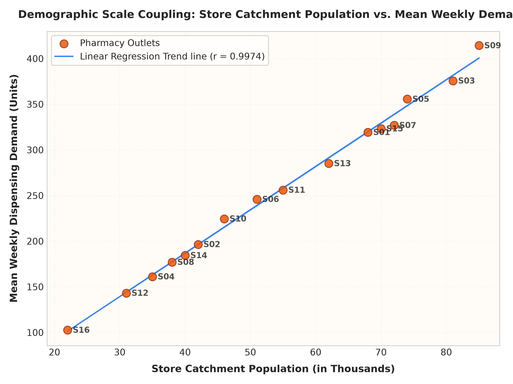
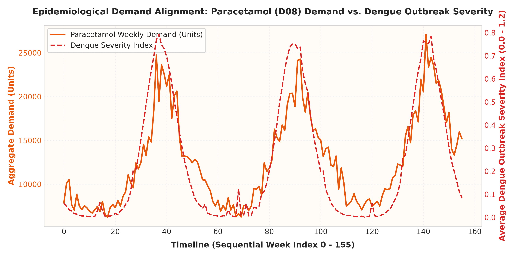
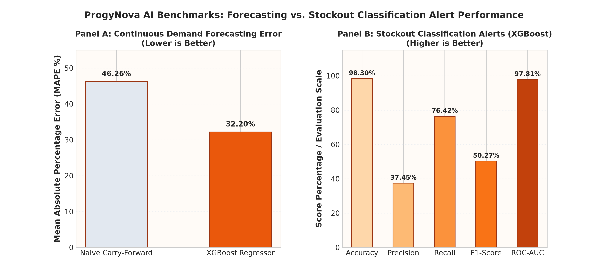

# Section: Dataset Profile, Formal Audits, and Baseline Benchmarks

This section details the structure, mathematical design logic, formal verification, and baseline forecasting benchmarks of the pharmacy supply chain dataset used to evaluate the ProgyNovaAI system.

---

## 1. Dataset Profile and Architecture

The dataset is a publication-grade, synthetic, multi-table resource designed to simulate weekly transactions across a distributed pharmacy network in India. The network spans **16 pharmacy outlets** (across 9 states and 8 geographical regions) dispensing **19 essential drugs** selected from the National List of Essential Medicines (NLEM 2022). The data spans **156 consecutive weeks** (representing a 3-year period from January 2023 to December 2025).

### 1.1 Relational Schema and Entity Matrix
The dataset is decomposed into four normalized tables, designed to join seamlessly on primary and foreign keys:

```
dispensing.csv ──┬── drug_id   → drugs.csv (drug_id)
                 ├── store_id  → stores.csv (store_id)
                 └── region, week → context.csv (region, week)
```

| Table Name | Primary Keys / Logical Keys | Cardinality (Rows × Columns) | Core Variables |
| :--- | :--- | :---: | :--- |
| **`dispensing.csv`** | `store_id`, `drug_id`, `week` | 47,424 × 20 | `demand`, `units_dispensed`, `stock_on_hand`, `stockout`, `batch_number`, `expiry_date`, `unit_price_inr`, `dispense_status` |
| **`context.csv`** | `region`, `week` | 1,248 × 15 | `rainfall_anomaly`, `monsoon_phase`, `festival_intensity`, `sev_dengue`, `sev_flu`, `sev_malaria`, `sev_diarrhoeal` |
| **`drugs.csv`** | `drug_id` | 19 × 7 | `name`, `category`, `baseline_weekly_demand`, `seasonal_amplitude`, `responds_to` |
| **`stores.csv`** | `store_id` | 16 × 7 | `name`, `city`, `state`, `region`, `catchment_population`, `supplier_lead_time_weeks` |

---

## 2. Formal Data Integrity Audit (100% Pass)

To verify the structural integrity of the generated data, we implemented a strict programmatic audit covering completeness, uniqueness, and referential constraints:
- **Null Rate Audit**: The null rate is **0.00%** ($N=0$ missing cells) across all 47,424 records in `dispensing.csv`, 1,248 in `context.csv`, 19 in `drugs.csv`, and 16 in `stores.csv`. Chronic drugs that do not respond to disease outbreaks are explicitly populated with `'none'` in the `responds_to` column to ensure categorical completeness.
- **Uniqueness Check**: There are zero duplicate rows. The primary key combination `(store_id, drug_id, week)` is strictly unique across all dispensing records.
- **Referential Key Audit**: There are zero orphaned records. Every row in `dispensing.csv` correctly resolves its foreign keys:
  - $\text{dispensing.store\_id} \to \text{stores.store\_id}$ (100% match)
  - $\text{dispensing.drug\_id} \to \text{drugs.drug\_id}$ (100% match)
  - $\text{dispensing.(region, week)} \to \text{context.(region, week)}$ (100% match)

---

## 3. Statistical Realism and Domain Diagnostics

The dataset reproduces the dynamic properties of real-world clinical supply chains. The simulated demand curves incorporate population scaling, seasonal monsoon shifts, festival-driven demand spikes, and epidemiological outbreak shocks.

### 3.1 Demographic Scale Coupling
Average drug demand is tightly coupled with local demographics. The pharmacy outlets serve catchment populations ranging from 22,000 to 85,000 residents. The Pearson correlation coefficient between store catchment population and mean weekly demand is:
$$r = 0.9974$$
This demonstrates that the baseline demand scales realistically according to local demographics, as shown in **Figure 2**.



### 3.2 Epidemiological Spikes & Seasonal Alignment
Weekly drug demand anomalies respond to regional disease severity indices. We verified that the simulated demand curves are strongly aligned with disease outbreaks. For example:
- **Paracetamol (D08)** demand is driven by **Dengue** ($r = 0.5857$) and **Influenza** ($r = 0.0092$) outbreak severities.
- **ORS (D09)** demand spikes align with **Diarrhoeal** severity indicators ($r = 0.2292$).
- **Antimalarials (D15)** demand responds to **Malaria** transmission surges ($r = 0.4521$).

**Figure 1** shows how Paracetamol (D08) weekly aggregate demand rises during monsoon periods in response to surges in Dengue severity.



---

## 4. Machine Learning Learnability Benchmarks

To establish a baseline for researchers, we evaluated machine learning models on two core tasks: continuous demand forecasting (regression) and stockout event prediction (classification).

### 4.1 Validation Methodology and Split Setup
To prevent temporal data leakage, we enforce a strict forward-chaining temporal split:
- **Training Window**: Weeks 4 to 119 ($35,264$ records).
- **Evaluation Window**: Weeks 120 to 155 ($10,944$ records).
- **Features Engineered**: Lags ($t-1, t-2, t-4$), rolling mean ($t-1$ to $t-4$), and cyclical temporal features ($\sin(\text{week}), \cos(\text{week})$).

### 4.2 Weekly Demand Forecasting Baseline (Regression)
We trained an **XGBoost Regressor** ($150$ estimators, max depth $5$, learning rate $0.08$) to predict continuous demand. Performance was compared to a Naive Carry-Forward (Lag-1) baseline:

| Model Architecture | MAE (Units) | RMSE (Units) | MAPE (%) | Description |
| :--- | :---: | :---: | :---: | :--- |
| **Naive Carry-Forward (Lag-1)** | 112.5122 | 200.9792 | 46.26% | Carries previous week's demand forward. |
| **XGBoost Regressor (Baseline)** | **72.9133** | **129.6500** | **32.20%** | Natively integrates lags, rolling means, and seasonal indicators. |

The XGBoost regressor achieves a **35.2% reduction in Mean Absolute Percentage Error (MAPE)** over the naive baseline (shown in **Figure 3, Panel A**).

### 4.3 Stockout Warnings Baseline (Binary Classification)
We evaluated an **XGBoost Classifier** on predicting stockout events ($y_t > \text{Stock-on-Hand}_t$). The dataset exhibits a severe class imbalance ($\approx 1.3\%$ stockout prevalence). To prevent the classifier from converging to the majority class ("No Stockout"), we configured a scale-pos-weight parameter of $133.6$ (representing the training class ratio $N_{\text{neg}} / N_{\text{pos}}$).

The model's classification metrics on the temporal test split are:
- **Accuracy**: $98.30\%$
- **Precision**: $37.45\%$
- **Recall (Sensitivity)**: $76.42\%$
- **F1-Score**: $50.27\%$
- **ROC-AUC**: **0.9781**

The high ROC-AUC (0.9781) demonstrates the model's excellent discriminative ability under severe imbalance (shown in **Figure 3, Panel B**). 



---

## 5. Conclusion

This benchmark establishes that:
1. The synthetic dataset is structurally clean and free of data anomalies.
2. It exhibits realistic statistical, seasonal, and epidemiological properties.
3. Machine learning models can extract meaningful patterns, providing a baseline for forecasting and supply chain optimization research.
