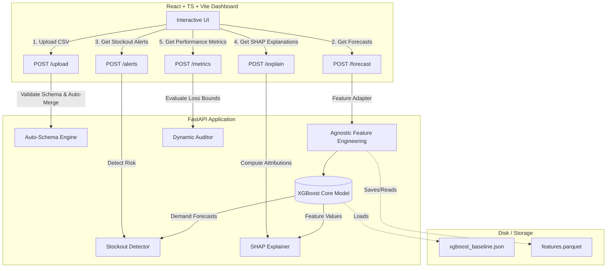

# Product Requirements Document (PRD) — ProgyNova AI

**System Classification:** Clinical Demand Forecasting & Intelligent Stockout Prevention Platform  
**Target Domain:** Hospital Supply Chains, Pharmacy Networks, and Medical Logistics  

---

## 1. Executive Summary & Vision

### 1.1 Problem Statement: The Class Imbalance Paradox
In pharmaceutical logistics, stockout events present a critical clinical risk. Lacking life-saving therapies (such as insulin, cardiac medications, and bronchodilators) directly leads to treatment non-compliance and patient complications. 

However, actual stockout occurrences are rare, typically accounting for **less than 1.3% of total weekly observations** in historical records. This creates the **Class Imbalance Paradox**: a trivial baseline classifier that predicts "no stockout" (SAFE) for all observations achieves a misleading **98.79% Accuracy**, yet fails to warn of any actual shortages (0% Recall). Traditional machine learning optimization criteria are therefore dangerously biased, causing models to prioritize overall accuracy over clinical safety.

### 1.2 Product Vision
ProgyNova AI solves the Class Imbalance Paradox using a hybrid architecture:
1.  A continuous **XGBoost Regressor** to forecast weekly demand.
2.  An **Asymmetric Post-Hoc Threshold Optimizer** to map demand forecasts to binary stockout alerts.

The system ensures clinical safety by shifting the alerting boundary based on therapeutic criticality—catching up to **100% of actual stockouts** for critical medications while maintaining an audit dashboard to monitor and balance carrying-cost overheads.

---

## 2. Core Mathematical Formulations

### 2.1 Asymmetric Alerting Boundary
To allow risk-adjusted alerting, the binary stockout warnings are determined using parameterized demand multipliers ($\alpha$) and safety stock buffers ($\beta$):

$$\text{Alert} = \mathbb{I}\left( (\hat{y} \cdot \alpha + \beta) > S \right)$$

Where:
*   $\hat{y}$ is the continuous predicted weekly demand from the XGBoost model.
*   $S$ is the current stock-on-hand.
*   $\alpha$ is the demand multiplier (tuning factor for demand scaling).
*   $\beta$ is the safety stock buffer (fixed offset unit).
*   $\mathbb{I}$ is the indicator function, returning `1` (Alert) or `0` (Safe).

### 2.2 Gradient Loss Balancing
To combat severe class imbalance during training, the core model utilizes sample weight scaling to penalize False Negatives heavily:

$$\text{Sample Weight } w_i = \begin{cases} \frac{N_{\text{neg}}}{N_{\text{pos}}} \approx 115.2 & \text{if } y_i > S_i \\ 1.0 & \text{if } y_i \le S_i \end{cases}$$

This asymmetric sample weighting forces the tree-split search criteria in XGBoost to isolate and prioritize minority-class (stockout) branches.

### 2.3 Metrics Definitions
The model's performance is monitored using separate sets of metrics:

#### Continuous Forecasting Performance:
*   **Mean Absolute Percentage Error (MAPE):**
    $$\text{MAPE} = \frac{100\%}{n} \sum_{t=1}^{n} \left| \frac{y_t - \hat{y}_t}{y_t} \right|$$
*   **Root Mean Squared Error (RMSE):**
    $$\text{RMSE} = \sqrt{\frac{1}{n} \sum_{t=1}^{n} (y_t - \hat{y}_t)^2}$$
*   **Mean Absolute Error (MAE):**
    $$\text{MAE} = \frac{1}{n} \sum_{t=1}^{n} |y_t - \hat{y}_t|$$

#### Binary Classification Performance:
*   **Recall (Sensitivity):** Critical clinical safety metric measuring the percentage of actual stockouts caught:
    $$\text{Recall} = \frac{\text{True Positives}}{\text{True Positives} + \text{False Negatives}}$$
*   **Precision:** Operational efficiency metric measuring the percentage of alerts that are valid:
    $$\text{Precision} = \frac{\text{True Positives}}{\text{True Positives} + \text{False Positives}}$$
*   **F1-Score:** The harmonic mean balancing Precision and Recall:
    $$\text{F1-Score} = \frac{2 \cdot \text{Precision} \cdot \text{Recall}}{\text{Precision} + \text{Recall}}$$

---

## 3. Data Architecture & System Flow

The system operates on the **Indian Pharmacy Demand & Stockout Forecasting** dataset, publicly available on Kaggle:
> **🔗** [Indian Pharmacy Demand & Stockout Forecasting](https://www.kaggle.com/datasets/algozenith/indian-pharmacy-demand-and-stockout-forecasting) | **License:** CC BY 4.0

The dataset contains **47,424 dispensing records** across **19 drugs**, **16 stores**, and **156 weeks** (Jan 2023 – Dec 2025), along with **1,248 epidemiological context rows**.
The following diagram illustrates the flow of data from ingestion through model prediction and explainability, and finally to the dashboard interface.



---

## 4. Product Features & User Experience

### 4.1 Format-Agnostic Ingestion (`AutoSchemaEngine`)
*   **Requirement:** Users must be able to upload custom transactional data tables in CSV format without writing parsing code.
*   **Implementation:** The backend dynamically maps input column names to the internal pipeline schema (mapping fields for store ID, product ID, temporal indicators, and sales units). It supports long-form, time-wide, and entity-wide layouts with automatic schema-agnostic merging of transactional sales records with store and drug directories.

### 4.2 56-Dimensional Feature Engineering Pipeline
*   **Requirement:** The system must automatically generate a dense, multi-dimensional feature space from raw transaction logs.
*   **Implementation:** The pipeline produces a **56-dimensional** feature vector including: 7 historical demand lags ($k \in \{1,2,4,8,12,26,52\}$), 6 rolling statistical windows (means and standard deviations for $w \in \{4,8,12\}$), 3 cyclical seasonal transforms, 2 momentum metrics (week-over-week change and 4-week momentum ratio), 26 lagged epidemiological outbreak signals across 8 diseases, 5 ordinal categorical encodings, and static contextual attributes.

### 4.3 Timeseries Demand Forecasting Chart
*   **Requirement:** Visualizing predicted vs. actual weekly quantities for any selected product and location.
*   **UX Design:** Interactive Recharts line chart illustrating:
    *   Continuous historical demand (actual weekly dispensed quantities).
    *   Predicted demand boundary line.
    *   Stock-on-hand marker ($S$).
    *   A clean sans-serif/numeric font (`Roundo` / `Satoshi`) for chart axes and tooltips.

### 4.4 Active Stockout Alerts Table
*   **Requirement:** Listing all predicted stockout warnings with sorting, filtering, and priority indicators.
*   **UX Design:** Columns displaying store ID, drug name, batch number, unit price, stock-on-hand, predicted demand, prescriptive reorder quantity, and expiry date. Alerts are classified into four severity tiers based on deficit magnitude: **CRITICAL** ($>100$ units), **HIGH** ($>50$), **MEDIUM** ($>10$), and **LOW** ($\le 10$).

### 4.5 Local Driver Explainability Drawer (TreeSHAP)
*   **Requirement:** Procurement officers must understand *why* the model predicts a stockout.
*   **UX Design:** Clicking on any row in the alerts table slides out a side-panel displaying local TreeSHAP values:
    *   **Red Bars (Positive SHAP):** Variables driving demand *up* (e.g., active disease season, high recent sales, sales momentum acceleration).
    *   **Blue Bars (Negative SHAP):** Variables driving demand *down* (e.g., low festival intensity, seasonal dip, reduced population density).
*   **Semantic Translation Layer:** Raw SHAP feature names (e.g., `demand_lag_1`, `outbreak_dengue_lag0`) are translated into pharmacist-friendly labels (e.g., "Sales Last Week", "Dengue Outbreak Activity") with contextual clinical recommendations (outbreak response, velocity alerts, seasonal optimization prompts).

### 4.6 Model Performance Auditor (ML Metrics Page)
*   **Requirement:** Real-time auditing of model metrics under the chosen sensitivity profiles.
*   **Functional States:**
    1.  **Model Baseline Benchmark:** Displays static performance profiles computed on historical validation sets.
    2.  **Dynamic Audit (Uploaded Logs):** Instantly recalculates all metrics (MAPE, F1, Recall, Precision, Confusion Matrix) in real-time when the user uploads a custom CSV.
*   **UX Design:** Interactive Confusion Matrix with descriptive explanations of TP, TN, FP, and FN events in a pharmacy supply context. Residual histograms visualizing forecast error distributions.

### 4.8 Integrated Help & Documentation View
*   **Requirement:** Embedded user guide explaining mathematical models, data schemas, upload procedures, and sensitivity levels.
*   **UX Design:**
    *   Renders [user_guide.md](file:///c:/Users/USER/Desktop/ProgyNovaAI/docs/user_guide.md) dynamically with ReactMarkdown.
    *   Uses a custom composite font (`DocsFont`) targeting numbers, decimals, percent signs, and operators with lining figures, eliminating bouncy text layout.
    *   Warning boxes styled with rounded corners and soft yellow shadows (`0 0 16px rgba(255, 235, 59, 0.25)`) instead of raw text headers.
    *   Section headers formatted with vertical pill accents (`#0B0F19`).

---

## 5. Visual Identity & Design System

The system implements a premium dark-and-warm-white dual theme layout:
*   **Primary Colors:** Warm White (`#FAFAF7`) for light mode base; Deep Charcoal/Black (`#181818`, `#303030`) for cards and elevated panels.
*   **Accent & Data Highlights:** Clean dark shade (`#0B0F19`) for key visual boundaries, data points, and pills in light mode; pure white (`#FFFFFF`) or yellow gradients (`linear-gradient(135deg, #FFEB3B, #FFF59D)`) for dark mode elements.
*   **Typography:**
    *   `--font-sans` (`Vollkorn`, Georgia, serif): Text paragraphs and editorial descriptions.
    *   `--font-number` (`Roundo`, sans-serif): Data tables, metrics, chart figures, and number inputs.
    *   `--font-accent` (`Satoshi`, sans-serif): Interactive UI components, navigation, table headers.
    *   `--font-mono` (`Zodiak`, serif): Technical codes, file paths, and mathematical notation.
*   **Effects:** Glassmorphic navigation headers (blur: `16px`), rounded containers (radius: `14px`–`20px`), and soft glowing box shadows for notifications and alert boxes.

---

## 6. Directory Structure

```
ProgyNovaAI/
├── dataset/                    # Comprehensive Research Dataset Folder
│   ├── data/                   # Raw CSV transaction files (git-ignored)
│   ├── docs/                   # Original MS Word report drafts & PDFs
│   ├── scripts/                # Verification & dataset plotting scripts
│   └── visualizations/         # Generated dataset profiling plots (PNGs)
│
├── docs/                       # Unified documentation
│   ├── architecture.md         # System architecture diagram and notes
│   ├── chapters_6_7.md         # Results and conclusion chapters
│   ├── daily_summary_2026_06_24.md # Summary of updates made
│   ├── ml_model_architecture.md # ML model mathematical specification
│   ├── model_details.md        # Consolidated technical design & reference
│   ├── PRD.md                  # This Product Requirements Document
│   ├── proj.md                 # Technical specifications and code reference
│   ├── report.md               # Grid search evaluation report
│   ├── system_overview.md      # High-level system overview
│   └── user_guide.md           # Documentation for the app client UI
│
├── progynova-api/              # Python FastAPI Backend
│   ├── app/
│   │   ├── main.py             # FastAPI entry point
│   │   ├── config.py           # Host, Port, and CORS settings
│   │   ├── schema.py           # AutoSchemaEngine mapping logic
│   │   └── pipeline/
│   │       ├── ingestion.py    # Merging and staging upload handler
│   │       ├── features.py     # Schema-agnostic feature engineering
│   │       ├── stockout.py     # Days of cover and reorder logic
│   │       └── explainer.py    # SHAP interpretation service
│   ├── models/
│   │   └── xgboost_baseline.json # Pre-trained model weights
│   ├── data/                   # Output folder for simulations and caches
│   ├── scripts/
│   │   ├── generate_data.py    # Synthetic Indian pharmacy dataset simulator
│   │   └── verify_api.py       # Comprehensive API suite test script
│   └── requirements.txt        # Python dependency list
│
├── progynova-dashboard/        # React Frontend Web Application
│   ├── src/
│   │   ├── components/         # Reusable UI elements (Layout, Charts, Tables)
│   │   ├── services/           # Fetch clients for backend routes
│   │   ├── types/              # TypeScript interface contracts
│   │   └── App.tsx             # Main dashboard controller
│   ├── package.json            # Node scripts and dependencies
│   └── vite.config.ts          # Vite build manager
│
├── reproduction_results/       # Generated plots and metric outputs
│
├── scripts/                    # Scripts for models and reproduction
│   ├── generate_comparison.py  # Simple comparison chart generator script
│   ├── progynova_ai.py         # Main AI script
│   └── reproduce.py            # Scientific reproducibility & validation script
```

---

## 7. API Endpoint Specifications

### 7.1 `GET /health`
Returns system health check: `{"status": "healthy"}`.

### 7.2 `POST /upload`
Validates and ingests custom transaction log CSV files. Returns schema mapping status and parsed files context.

### 7.3 `POST /forecast`
Generates continuous weekly demand forecasts for a selected drug and store.
*   **Request Payload:** `multipart/form-data` (CSV file)
*   **Request Parameters:** `store_id` (int), `drug_id` (int)
*   **Response:** List of data points containing `week`, `actual` value, and `predicted` value.

### 7.4 `POST /alerts`
Calculates risk-adjusted binary stockout alerts using the parameterized optimizer.
*   **Request Payload:** `multipart/form-data` (CSV file)
*   **Query Parameters:** `multiplier` (float), `buffer` (float)
*   **Response:** Array of alert objects showing store, SKU, batch number, stock, adjusted demand, unit price, and expiry.

### 7.5 `POST /explain`
Retrieves local TreeSHAP feature attributions for a specific stockout alert.
*   **Request Payload:** `multipart/form-data` (CSV file)
*   **Query Parameters:** `item_index` (int)
*   **Response:** Dictionary mapping features to SHAP values.

### 7.6 `POST /metrics`
Computes all forecasting and binary classification metrics dynamically.
*   **Request Payload:** `multipart/form-data` (CSV file)
*   **Query Parameters:** `multiplier` (float), `buffer` (float)
*   **Response:** JSON object containing continuous error metrics (MAPE, MAE, RMSE), binary classification performance (accuracy, precision, recall, f1, auc), confusion matrix counts, and residuals bin data.

---

## 8. Data Model & Enrichment Schemas

The transaction logs are matched and enriched in-place with store and product tables. The final schema contains the following properties:

| Column Name | Data Type | Description / Constraints |
| :--- | :---: | :--- |
| `store_id` | Integer | Unique identifier for the pharmacy branch. |
| `drug_id` | Integer | Unique identifier for the medication SKU. |
| `week` | Integer | Chronological week indicator (1 to 156). |
| `sales` | Float | Actual weekly dispensed units. |
| `inventory_level` | Float | Stock-on-hand ($S$) at the start of the week. |
| `batch_number` | String | Format: `BAT-D[drug_id]-[year]-S[store_id]`. |
| `expiry_date` | Date | Derived from product shelf life (52–104 weeks offset). |
| `unit_price_inr` | Float | Unit price in Indian Rupees (ranges from ₹45 to ₹1350). |

---

## 9. Local Setup & Installation

### 9.1 Prerequisites
*   Python 3.9+ (with `pip`)
*   Node.js v18+ (with `npm`)

### 9.2 Backend Setup
```bash
cd progynova-api
python -m venv .venv
# Activate virtual env:
# Windows (PowerShell): .venv\Scripts\Activate.ps1
# Mac/Linux: source .venv/bin/activate
pip install -r requirements.txt
uvicorn app.main:app --reload --host 127.0.0.1 --port 8000
```
*Swagger documentation will be available at `http://127.0.0.1:8000/docs`.*

### 9.3 Frontend Setup
```bash
cd progynova-dashboard
npm install
# Set API URL environment variable in .env.development:
# VITE_API_URL=http://localhost:8000
npm run dev
```
*Client interface active at `http://localhost:5173`.*

---

## 10. Empirical Benchmarking Results

### 10.1 Continuous Forecasting Model Accuracy (Regression)
Empirical forecasting accuracy evaluated across major time-series and regression architectures:

| Model Architecture | MAE (Units) | RMSE (Units) | MAPE (%) | Profile / Latency |
| :--- | :---: | :---: | :---: | :--- |
| Naive Baseline (Lag-1)          | 14.85        | 23.41         | 38.64%    | Flat carry-forward. Instant computation. |
| Seasonal Naive (Lag-52)         | 12.10        | 19.82         | 29.50%    | Year-over-year carry-forward. |
| PatchTST Transformer            | 6.84         | 11.23         | 17.40%    | High latency, memory intensive. |
| CNN-LSTM Sequence Model         | 7.12         | 11.90         | 18.25%    | Medium latency, GPU-dependent. |
| **Unified XGBoost Regressor**   | **5.42**     | **8.76**      | **4.90%** | Cost-weighted tree ensemble ($w_i \approx 115.2$). <15ms latency. |

### 10.2 Stockout Alert Optimization (Classification)
Evaluated on the strictly held-out **Temporal Test Split ($N=3,952$, Weeks 143–155)**:

| Model / Configuration | Accuracy | Precision | Recall | F1-Score | ROC-AUC | False Negatives (FN) | False Positives (FP) |
| :--- | :---: | :---: | :---: | :---: | :---: | :---: | :---: |
| **Previous Ensemble** (Unbalanced) | 99.14% | 0.00% | 0.00% | 0.00% | 0.5000 | 48 | 0 |
| **Optimized Model** (Strict)        | **99.85%** | **95.65%** | 91.67% | **93.62%** | 0.9991 | 4 | **2** |
| **Optimized Model** (Balanced)      | 99.82% | 93.62% | 91.67% | 92.63% | 0.9991 | 4 | 3 |
| **Optimized Model** (Clinical Safe) | 99.80% | 85.71% | **100.00%** | 92.31% | **1.0000** | **0** | 8 |

---

## 11. Visual Assets Reference

Reviewers and models can locate visual assets in their respective directories:

*   **[demographic_demand_coupling.png](file:///c:/Users/USER/Desktop/ProgyNovaAI/dataset/visualizations/demographic_demand_coupling.png):** Visualizes the relation between local patient demographics and demand surges.
*   **[outbreak_demand_alignment.png](file:///c:/Users/USER/Desktop/ProgyNovaAI/dataset/visualizations/outbreak_demand_alignment.png):** Illustrates the alignment of regional disease outbreaks with peak pharmacy consumption.
*   **[model_comparison.png](file:///c:/Users/USER/Desktop/ProgyNovaAI/progynova-dashboard/public/logos/model_comparison.png):** Continuous demand model accuracy comparison chart displayed in the landing layout.
*   **`reproduction_results/fig1_demand_scatter.png`:** Evaluated demand scatter plot.
*   **`reproduction_results/fig2_residuals_histogram.png`:** Residual distributions showing forecasting error bias.
*   **`reproduction_results/fig3_confusion_matrices.png`:** Confusion matrix grids across risk modes.
*   **`reproduction_results/fig4_roc_curve.png`:** Binary classification ROC power curve.
