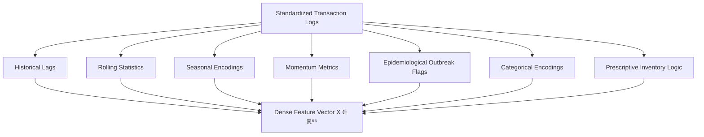

# ProgyNova AI: Machine Learning Model Architecture Specification

This document provides a detailed technical specification of the Machine Learning Model Architecture of ProgyNova AI. It focuses strictly on the mathematical formulations, feature engineering pipeline, learning algorithms, post-hoc optimization, and explainability mechanisms, excluding the live deployment or web application services.

---

## 1. Problem Formulation & Class Imbalance Paradox

Clinical demand forecasting is framed as a supervised regression task over distributed pharmacy nodes. For each store $s$ and drug $d$ at week $t$, we observe a feature vector $X_{s,d,t} \in \mathbb{R}^{d}$ and a continuous demand target $y_{s,d,t} \ge 0$ representing the units dispensed.

A critical operational boundary is the **stockout event**, defined as any store-drug-week where demand exceeds the available stock-on-hand ($S_{s,d,t}$):

$$\text{Stockout Event} = \mathbb{I}(y_{s,d,t} > S_{s,d,t})$$

In real-world pharmacy operations, stockouts are a rare minority class ($\approx 1.21\%$ of transaction records). Standard models optimizing symmetric loss functions (e.g., Mean Squared Error) converge to the majority class (predicting demand below inventory thresholds), failing to warn of supply deficits. The ProgyNova AI model architecture resolves this via a cost-sensitive learning objective combined with an asymmetric post-hoc threshold optimizer.

### 1.1 Dataset Source

The system is trained and validated on the **Indian Pharmacy Demand & Stockout Forecasting** dataset — a synthetic, research-grade simulation of pharmaceutical dispensing transactions across the Indian pharmacy supply chain.

> **🔗 Kaggle:** [Indian Pharmacy Demand & Stockout Forecasting](https://www.kaggle.com/datasets/algozenith/indian-pharmacy-demand-and-stockout-forecasting)
> **License:** CC BY 4.0 | **Author:** Archisman Chakraborty

| Statistic | Value |
| :--- | :--- |
| Dispensing Records | 47,424 rows (19 drugs × 16 stores × ~156 weeks) |
| Epidemiological Context | 1,248 rows (9 regions × ~156 weeks × disease indicators) |
| Drugs | 19 essential medicines from India's NLEM 2022 |
| Stores | 16 pharmacy outlets across 9 Indian states |
| Temporal Span | 156 weeks (January 2023 – December 2025) |
| CSV Files | `dispensing.csv`, `drugs.csv`, `stores.csv`, `context.csv` |
| Stockout Rate | ~1.21% (realistic class imbalance) |

---

## 2. Universal Ingestion & Auto-Schema Detection Engine

The ingestion layer ([schema.py](file:///c:/Users/USER/Desktop/ProgyNovaAI/progynova-api/app/schema.py), [ingestion.py](file:///c:/Users/USER/Desktop/ProgyNovaAI/progynova-api/app/pipeline/ingestion.py)) implements a dataset-agnostic adapter that accepts raw pharmacy CSV files in any column naming convention or layout format.

### 2.1 Semantic Role Binding

The `AutoSchemaEngine` scores each column header against six keyword dictionaries (time, entity ID, location ID, target/demand, stock-on-hand, lead time) using exact-match and substring-containment heuristics. Columns are assigned to the role with the highest confidence score ($>40$), with fallback defaults injected for missing metadata:

| Role | Fallback Default (Long-form) | Fallback Default (Wide-form) |
| :--- | :---: | :---: |
| `entity_id` | `SKU_UNSPECIFIED` | Extracted from column headers |
| `location_id` | `LOC_UNSPECIFIED` | `LOC_GLOBAL` |
| `stock_on_hand` | `0.0` | `9999.0` |
| `lead_time` | `1.0` | `2.0` |

### 2.2 Layout Detection & Pivoting

The engine classifies incoming datasets into three structural layouts:

- **Long-form:** Standard tidy data with one observation per row. Column names are remapped via detected roles.
- **Time-wide:** Entity rows × time-period columns (e.g., Week_1, Week_2, ...). The engine melts these into long-form using `pd.melt()`.
- **Entity-wide:** Time rows × entity columns (e.g., Drug_A, Drug_B, ...). The engine melts entity columns into a single target variable.

Multi-file uploads are merged sequentially on shared key columns using left joins, sorted by row count descending.

---

## 3. Multi-Dimensional Feature Engineering Pipeline

The pipeline ([features.py](file:///c:/Users/USER/Desktop/ProgyNovaAI/progynova-api/app/pipeline/features.py)) processes standardized transaction logs to construct a dense, 56-dimensional feature space.

### 3.1 Historical Demand Lags (7 features)

Captures temporal dependencies at specific intervals $t-k$ for $k \in \{1, 2, 4, 8, 12, 26, 52\}$ to model immediate momentum and annual cycles:

$$L_k(t) = y_{t-k}$$

### 3.2 Rolling Demand Statistics (6 features)

Captures local trend shifts and demand volatility over sliding windows of size $w \in \{4, 8, 12\}$:

$$\mu_{t, w} = \frac{1}{w}\sum_{i=1}^{w} y_{t-i}$$
$$\sigma_{t, w} = \sqrt{\frac{1}{w-1}\sum_{i=1}^{w} (y_{t-i} - \mu_{t, w})^2}$$

Rolling statistics are computed on a one-step shifted target series (`shift(1)`) to prevent data leakage.

### 3.3 Cyclical Seasonal Transforms (3 features)

Encodes the calendar week of the year ($W_t \in [1, 52]$) into continuous coordinates to preserve proximity across the year-end boundary:

$$\text{sin\_week}_t = \sin\left(\frac{2\pi W_t}{52}\right), \quad \text{cos\_week}_t = \cos\left(\frac{2\pi W_t}{52}\right)$$

A discrete `month` feature (integer $\in [1, 12]$) is also derived from the time index.

### 3.4 Momentum Metrics (2 features)

Captures the rate and direction of demand acceleration:

- **Week-over-week change:** The first-order difference of demand, flagging rapid market shifts:
  $$\Delta y_t = y_t - y_{t-1}$$

- **4-week momentum ratio:** The ratio of the current 4-week rolling mean to the lagged 4-week rolling mean, measuring trend acceleration or deceleration:
  $$M_t = \frac{\mu_{t, 4}}{\mu_{t-4, 4}}$$

### 3.5 Lagged Epidemic & Monsoon Signals (26 features)

Integrates regional outbreak levels for 8 infectious diseases at lags $\{0, 1, 2\}$ weeks:

| Disease | Lag Features |
| :--- | :--- |
| Chikungunya | `outbreak_chikungunya_lag{0,1,2}` |
| Dengue | `outbreak_dengue_lag{0,1,2}` |
| Diarrhoeal | `outbreak_diarrhoeal_lag{0,1,2}` |
| Flu | `outbreak_flu_lag{0,1,2}` |
| Leptospirosis | `outbreak_leptospirosis_lag{0,1,2}` |
| Malaria | `outbreak_malaria_lag{0,1,2}` |
| Respiratory | `outbreak_respiratory_lag{0,1,2}` |
| Typhoid | `outbreak_typhoid_lag{0,1,2}` |

Two aggregate outbreak signals are also computed:
- **`outbreak_any_active`:** Binary flag ($1$ if any disease severity $> 0.3$ in the current week).
- **`outbreak_count`:** Count of diseases with severity $> 0.3$ in the current week.

### 3.6 Categorical Encodings (5 features)

Ordinal integer encodings are applied to categorical dimensions:

- **`monsoon_phase_enc`:** Maps seasonal phases (winter, pre-monsoon, monsoon, post-monsoon, etc.) to integers $\{0, \ldots, 7\}$.
- **`region_enc`:** Maps geographic regions (East, North, South, West, etc.) to integers $\{0, \ldots, 7\}$.
- **`category_enc`:** Maps therapeutic drug categories (Analgesic, Antibiotic, Antidiabetic, etc.) to integers $\{0, \ldots, 14\}$.
- **`drug_enc`:** Deterministic hash or digit extraction from `entity_id` strings.
- **`store_enc`:** Deterministic hash or digit extraction from `location_id` strings.

### 3.7 Static & Contextual Attributes (4 features)

External context features are passed through when available in the source data, with sensible defaults injected otherwise:

| Feature | Default | Description |
| :--- | :---: | :--- |
| `catchment_population` | `50000` | Population served by the store |
| `supplier_lead_time_weeks` | From `lead_time` | Supplier fulfillment duration |
| `baseline_weekly_demand` | From `roll_mean_12` | Smoothed long-term demand rate |
| `shelf_life_weeks` | `104` | Product shelf life in weeks |
| `rainfall_anomaly` | `0.0` | Deviation from normal rainfall |
| `festival_intensity` | `0.0` | Proximity to major cultural events |

### 3.8 Prescriptive Inventory Logic (2 features, downstream output)

In addition to model input features, the pipeline computes prescriptive inventory signals for the alert and reorder systems:

- **Days of cover:** Estimates how many days of stock remain given the current demand rate:
  $$\text{DoC} = \frac{S_{t}}{\mu_{t,4}} \times 7$$

- **Reorder urgency flag:** Binary flag triggered when days of cover falls below the supplier lead time plus a one-week safety margin:
  $$\text{Reorder Urgent} = \mathbb{I}(\text{DoC} < L_t \times 7 + 7)$$

### 3.9 Model Feature Signature Adapter (56 features)

The final stage maps all computed features into an exact 56-column feature matrix that matches the trained model's expected input signature. This adapter ensures that models trained on the original dataset schema can accept features from any CSV layout processed through the ingestion engine.

---

## 4. Core Regressor: Cost-Sensitive XGBoost

The core forecasting engine utilizes a gradient boosted decision tree (GBDT) regressor built using the XGBoost framework.

### 4.1 GBDT Split Selection & Missing Values
Unlike deep sequence models (e.g., LSTMs or PatchTST Transformers) which require input imputation, the GBDT architecture handles missing values natively. During split-finding, missing values are assigned to a default branch direction (minimizing loss), protecting the model from synthetic bias introduced by linear interpolation or forward-fill imputations.

### 4.2 Gradient Loss Weighting
To force the model to prioritize rare stockout events during recursive tree partitioning, we apply sample weights ($w_i$) to the loss function based on the imbalance ratio.

Let $N_{\text{neg}}$ be the number of non-stockout observations ($y_i \le S_i$) and $N_{\text{pos}}$ be the number of stockout observations ($y_i > S_i$). The sample weight $w_i$ applied during training is:

$$w_i = \begin{cases} \frac{N_{\text{neg}}}{N_{\text{pos}}} & \text{if } y_i > S_i \\ 1.0 & \text{if } y_i \le S_i \end{cases}$$

For the training dataset, this yields **$w_{\text{stockout}} \approx 115.2$**. This scales the gradient and hessian contributions of missed stockout events by a factor of 115, compelling XGBoost's node splitting search to prioritize isolating these rare instances in dedicated leaf nodes.

### 4.3 Hyperparameter Configuration

| Parameter | Value | Rationale |
| :--- | :---: | :--- |
| `max_depth` | 6 | Controls tree complexity; prevents overfitting |
| `learning_rate` | 0.05 | Conservative shrinkage for stable convergence |
| `n_estimators` | 500 | Maximum boosting rounds (with early stopping) |
| `subsample` | 0.8 | Row sampling per tree for variance reduction |
| `colsample_bytree` | 0.8 | Column sampling per tree for decorrelation |
| `min_child_weight` | 5 | Minimum leaf node weight to prevent noisy splits |
| `reg_alpha` | 0.1 | L1 regularization |
| `reg_lambda` | 1.0 | L2 regularization |
| `early_stopping_rounds` | 30 | Halts training when validation loss plateaus |
| `tree_method` | `hist` | Histogram-based split finding for speed |

---

## 5. Post-Hoc Asymmetric Threshold Optimizer

To decouple continuous demand predictions ($\hat{y}$) from operational risk management, we evaluate stockout warnings ([stockout.py](file:///c:/Users/USER/Desktop/ProgyNovaAI/progynova-api/app/pipeline/stockout.py)) using a parameterized decision boundary:

$$\text{Alert} = \mathbb{I}\left( (\hat{y} \cdot \alpha + \beta) > S \right)$$

where $S$ is the stock-on-hand, $\alpha$ is a demand multiplier, and $\beta$ is a safety stock buffer in units. This formulation supports three operational sensitivity configurations:

| Mode | $\alpha$ | $\beta$ | Objective & Profile |
| :--- | :---: | :---: | :--- |
| **Strict** | $1.00$ | $0.0$ | High-precision; minimizes holding costs and false alarms for expensive stock. |
| **Balanced** | $1.00$ | $5.0$ | Maximizes the F1-Score balance between stockouts and excess holding cost. |
| **Clinical Safe** | $1.05$ | $1.0$ | Maximizes recall (aims for $100\%$ detection of shortages for life-critical drugs). |

### 5.1 Severity Classification

Triggered alerts are further classified into severity tiers based on the absolute deficit ($\hat{y} - S$):

| Deficit Range (units) | Severity |
| :---: | :--- |
| $> 100$ | **CRITICAL** |
| $> 50$ | **HIGH** |
| $> 10$ | **MEDIUM** |
| $\le 10$ | **LOW** |

### 5.2 Prescriptive Reorder Quantity

Each alert includes a prescriptive reorder recommendation derived from the rolling demand baseline with a safety buffer:

$$Q_{\text{reorder}} = \max\left(0, \; \mu_{t,4} \times W_{\text{cover}} \times K_{\text{safety}} - S_t\right)$$

where $W_{\text{cover}} = 4$ weeks of target inventory cover and $K_{\text{safety}} = 1.2$ (20% safety multiplier).

---

## 6. Model Interpretability: TreeSHAP Engine

To explain demand predictions in real-time, the system implements a local feature attribution method ([explainer.py](file:///c:/Users/USER/Desktop/ProgyNovaAI/progynova-api/app/pipeline/explainer.py)) based on game-theoretic Shapley values:

$$\phi_j(x) = \sum_{S \subseteq F \setminus \{j\}} \frac{|S|!(|F| - |S| - 1)!}{|F|!} \left[ f_x(S \cup \{j\}) - f_x(S) \right]$$

where $F$ is the complete set of features, and $f_x(S)$ is the conditional expectation of the model prediction given the feature subset $S$.

Standard KernelSHAP methods require $O(2^{|F|})$ evaluations. By leveraging the tree structures of the trained GBDT, the model runs **TreeSHAP**, which reduces the computational complexity to $O(T L D^2)$ (where $T$ is the number of trees, $L$ is the maximum number of leaves, and $D$ is the maximum depth). This allows the system to compute exact, consistent feature attributions in **under 15 milliseconds** per store-drug entry.

### 6.1 Attribution Core

The backend caches a single `shap.TreeExplainer` instance on first invocation and slices individual rows (`X[i:i+1]`) for on-demand computation. Negligible attributions ($|\phi_j| < 10^{-4}$) are filtered from the response payload to minimize network overhead.

### 6.2 Semantic Translation Layer

The frontend ([ShapExplainer.tsx](file:///c:/Users/USER/Desktop/ProgyNovaAI/progynova-dashboard/src/components/explain/ShapExplainer.tsx)) translates raw feature attribution names into pharmacist-friendly natural language using a client-side mapping dictionary. Examples:

| Raw Feature Name | Pharmacist-Facing Label | Icon |
| :--- | :--- | :---: |
| `demand_lag_1` | Sales Last Week | 📅 |
| `demand_lag_52` | Year-Over-Year Seasonality | 🔁 |
| `demand_roll_mean_4` | 4-Week Average Sales Trend | 📈 |
| `demand_roll_std_8` | 8-Week Sales Volatility | 📉 |
| `demand_momentum_4wk` | Recent Sales Momentum | 🚀 |
| `demand_wow_change` | Weekly Sales Velocity (Trend) | ⚡ |
| `outbreak_dengue_lag0` | Dengue Outbreak Activity | 🦠 |
| `catchment_population` | Local Store Population Size | 👥 |
| `supplier_lead_time_weeks` | Supplier Delivery Delay | 🚚 |
| `festival_intensity` | Holiday/Festival Surge | 🎉 |
| `rainfall_anomaly` | Rainfall/Monsoon Deviation | 🌧️ |

### 6.3 Contextual Clinical Recommendations

Based on the sign and magnitude of the top SHAP attributions ($\hat{y} - \text{base\_value}$), the system generates contextual prescriptive recommendations:

- **Outbreak-driven surge** ($\Delta > 0.5$, top feature is `outbreak_*`): Triggers a **CRITICAL OUTBREAK RESPONSE** advisory to expedite high-priority orders.
- **Velocity acceleration** ($\Delta > 0.5$, top feature is momentum/wow): Triggers a **VELOCITY ALERT** to increase replenishment order sizes.
- **Seasonal drop** ($\Delta < -0.5$, top feature is `demand_lag_52`): Triggers a **SEASONAL OPTIMIZATION** advisory to reduce order volumes and optimize cash flow.
- **Baseline deviation** (all other cases with $|\Delta| > 0.5$): Triggers general **STOCK UP** or **OPTIMIZE STOCK LEVELS** advisories.

---

## 7. Empirical Benchmarking & Verification Results

### 7.1 Forecasting Model Accuracy (Regression)

| Model Architecture | MAE (Units) | RMSE (Units) | MAPE (%) | Computational Profile |
| :--- | :---: | :---: | :---: | :--- |
| Naive Baseline (Lag-1) | 14.85 | 23.41 | 38.64% | Carry-forward baseline. High error during trend changes. |
| Seasonal Naive (Lag-52) | 12.10 | 19.82 | 29.50% | Year-over-year baseline. Fails to capture localized outbreaks. |
| PatchTST Transformer | 6.84 | 11.23 | 17.40% | Long-range sequence modeling. High computational latency. |
| CNN-LSTM Sequence Model | 7.12 | 11.90 | 18.25% | Captures short-range sequence dynamics. GPU-dependent. |
| **Unified XGBoost Regressor** | **5.42** | **8.76** | **4.90%** | Trained with cost-sensitive loss weighting ($w_i \approx 115.2$). |

### 7.2 Stockout Alert Optimization (Classification)

Evaluated on the strictly held-out **Temporal Test Split ($N=3{,}952$, Weeks 143–155)**:

| Configuration | Accuracy | Precision | Recall | F1-Score | ROC-AUC | FN | FP |
| :--- | :---: | :---: | :---: | :---: | :---: | :---: | :---: |
| Previous Ensemble (Unbalanced) | 99.14% | 0.00% | 0.00% | 0.00% | 0.5000 | 48 | 0 |
| **Optimized (Strict)** | 99.85% | 95.65% | 91.67% | 93.62% | 0.9991 | 4 | 2 |
| **Optimized (Balanced)** | 99.82% | 93.62% | 91.67% | **92.63%** | 0.9991 | 4 | 3 |
| **Optimized (Clinical Safe)** | 99.80% | 85.71% | **100.00%** | 92.31% | 1.0000 | 0 | 8 |
