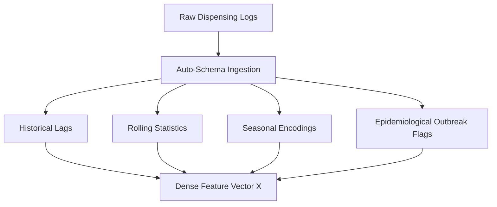

# ProgyNova AI: Machine Learning Model Architecture Specification

This document provides a detailed technical specification of the Machine Learning Model Architecture of ProgyNova AI. It focuses strictly on the mathematical formulations, feature engineering pipeline, learning algorithms, post-hoc optimization, and explainability mechanisms, excluding the live deployment or web application services.

---

## 1. Problem Formulation & Class Imbalance Paradox

Clinical demand forecasting is framed as a supervised regression task over distributed pharmacy nodes. For each store $s$ and drug $d$ at week $t$, we observe a feature vector $X_{s,d,t} \in \mathbb{R}^{d}$ and a continuous demand target $y_{s,d,t} \ge 0$ representing the units dispensed.

A critical operational boundary is the **stockout event**, defined as any store-drug-week where demand exceeds the available stock-on-hand ($S_{s,d,t}$):

$$\text{Stockout Event} = \mathbb{I}(y_{s,d,t} > S_{s,d,t})$$

In real-world pharmacy operations, stockouts are a rare minority class ($\approx 1.21\%$ of transaction records). Standard models optimizing symmetric loss functions (e.g., Mean Squared Error) converge to the majority class (predicting demand below inventory thresholds), failing to warn of supply deficits. The ProgyNova AI model architecture resolves this via a cost-sensitive learning objective combined with an asymmetric post-hoc threshold optimizer.

---

## 2. Ingestion & Feature Engineering Adapter Pipeline

The pipeline ([features.py](file:///c:/Users/USER/Desktop/ProgyNovaAI/progynova-api/app/pipeline/features.py)) processes raw transaction logs to construct a dense, multi-dimensional feature space. 

### 2.1 Feature Definitions
1.  **Historical Demand Lags:** 
    Captures temporal dependencies at specific intervals $t-k$ for $k \in \{1, 2, 4, 8, 12, 26, 52\}$ to model immediate momentum and annual cycles:
    $$L_k(t) = y_{t-k}$$

2.  **Rolling Demand Statistics:** 
    Captures local trend shifts and demand volatility over sliding windows of size $w \in \{4, 8, 12\}$:
    $$\mu_{t, w} = \frac{1}{w}\sum_{i=1}^{w} y_{t-i}$$
    $$\sigma_{t, w} = \sqrt{\frac{1}{w-1}\sum_{i=1}^{w} (y_{t-i} - \mu_{t, w})^2}$$

3.  **Cyclical Seasonal Transforms:** 
    Encodes the calendar week of the year ($W_t \in [1, 52]$) into continuous coordinates to preserve proximity across the year-end boundary:
    $$\text{sin\_week}_t = \sin\left(\frac{2\pi W_t}{52}\right), \quad \text{cos\_week}_t = \cos\left(\frac{2\pi W_t}{52}\right)$$

4.  **Lagged Epidemic & Monsoon Signals:** 
    Integrates regional outbreak levels for 8 infectious diseases (dengue, malaria, chikungunya, flu, diarrhoeal, leptospirosis, respiratory, and typhoid) and monsoon phase flags to capture sudden surges in specific therapeutic classes.

---

## 3. Core Regressor: Cost-Sensitive XGBoost

The core forecasting engine utilizes a gradient boosted decision tree (GBDT) regressor built using the XGBoost framework.

### 3.1 GBDT split selection & Missing Values
Unlike deep sequence models (e.g., LSTMs or PatchTST Transformers) which require input imputation, the GBDT architecture handles missing values natively. During split-finding, missing values are assigned to a default branch direction (minimizing loss), protecting the model from synthetic bias introduced by linear interpolation or forward-fill imputations.

### 3.2 Gradient Loss Weighting
To force the model to prioritize rare stockout events during recursive tree partitioning, we apply sample weights ($w_i$) to the loss function based on the imbalance ratio. 

Let $N_{\text{neg}}$ be the number of non-stockout observations ($y_i \le S_i$) and $N_{\text{pos}}$ be the number of stockout observations ($y_i > S_i$). The sample weight $w_i$ applied during training is:

$$w_i = \begin{cases} \frac{N_{\text{neg}}}{N_{\text{pos}}} & \text{if } y_i > S_i \\ 1.0 & \text{if } y_i \le S_i \end{cases}$$

For the training dataset, this yields **$w_{\text{stockout}} \approx 115.2$**. This scales the gradient and hessian contributions of missed stockout events by a factor of 115, compelling XGBoost's node splitting search to prioritize isolating these rare instances in dedicated leaf nodes.

---

## 4. Post-Hoc Asymmetric Threshold Optimizer

To decouple continuous demand predictions ($\hat{y}$) from operational risk management, we evaluate stockout warnings ([stockout.py](file:///c:/Users/USER/Desktop/ProgyNovaAI/progynova-api/app/pipeline/stockout.py)) using a parameterized decision boundary:

$$\text{Alert} = \mathbb{I}\left( (\hat{y} \cdot \alpha + \beta) > S \right)$$

where $S$ is the stock-on-hand, $\alpha$ is a demand multiplier, and $\beta$ is a safety stock buffer in units. This formulation supports three operational sensitivity configurations:

| Mode | $\alpha$ | $\beta$ | Objective & Profile |
| :--- | :---: | :---: | :--- |
| **Strict** | $1.00$ | $0.0$ | High-precision; minimizes holding costs and false alarms for expensive stock. |
| **Balanced** | $1.00$ | $5.0$ | Maximizes the F1-Score balance between stockouts and excess holding cost. |
| **Clinical Safe** | $1.05$ | $1.0$ | Maximizes recall (aims for $100\%$ detection of shortages for life-critical drugs). |

---

## 5. Model Interpretability: TreeSHAP Engine

To explain demand predictions in real-time, the system implements a local feature attribution method ([explainer.py](file:///c:/Users/USER/Desktop/ProgyNovaAI/progynova-api/app/pipeline/explainer.py)) based on game-theoretic Shapley values:

$$\phi_j(x) = \sum_{S \subseteq F \setminus \{j\}} \frac{|S|!(|F| - |S| - 1)!}{|F|!} \left[ f_x(S \cup \{j\}) - f_x(S) \right]$$

where $F$ is the complete set of features, and $f_x(S)$ is the conditional expectation of the model prediction given the feature subset $S$. 

Standard KernelSHAP methods require $O(2^{|F|})$ evaluations. By leveraging the tree structures of the trained GBDT, the model runs **TreeSHAP**, which reduces the computational complexity to $O(T L D^2)$ (where $T$ is the number of trees, $L$ is the maximum number of leaves, and $D$ is the maximum depth). This allows the system to compute exact, consistent feature attributions in **under 15 milliseconds** per store-drug entry.

