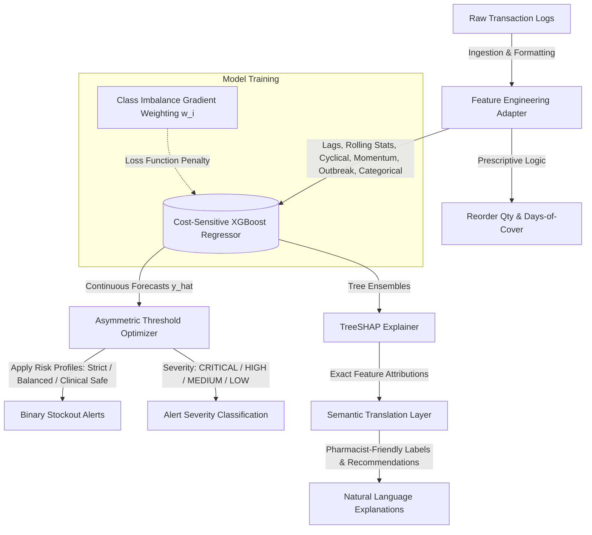

# ProgyNova AI: Detailed System Overview

ProgyNova AI is an advanced, production-grade demand forecasting and clinical stockout prediction platform. It is engineered specifically to address the **class imbalance paradox** of stockout events in healthcare supply chains, where life-saving therapies (such as insulin, bronchodilators, and oncology medications) are rarely out of stock ($\approx 1.21\%$ of observations) but are highly critical when they are.

The system is trained on the **Indian Pharmacy Demand & Stockout Forecasting** dataset (47,424 records, 19 drugs, 16 stores, 156 weeks):
> **🔗** [Kaggle Dataset](https://www.kaggle.com/datasets/algozenith/indian-pharmacy-demand-and-stockout-forecasting) | **License:** CC BY 4.0

This document serves as a high-level summary and map of the system's architecture, mathematical foundation, and files.

---

## 1. Model Pipeline Architecture & Component Mapping

The model architecture operates as a decoupled pipeline, separating feature engineering, regression modeling, risk-preferences thresholding, and model explainability.

### Core Pipeline Components
*   **Automatic Schema Engine ([ingestion.py](file:///c:/Users/USER/Desktop/ProgyNovaAI/progynova-api/app/pipeline/ingestion.py)):** Resolves raw input tabular structures dynamically into a standard internal format by mapping semantic roles (timestamps, entities, demand target) based on keywords configured in [schema.py](file:///c:/Users/USER/Desktop/ProgyNovaAI/progynova-api/app/schema.py). Supports long-form, time-wide, and entity-wide CSV layouts with automatic pivoting.
*   **Feature Engineering Pipeline ([features.py](file:///c:/Users/USER/Desktop/ProgyNovaAI/progynova-api/app/pipeline/features.py)):** Produces a **56-dimensional** feature vector by computing multi-interval historical lags ($k \in \{1,2,4,8,12,26,52\}$), rolling statistical windows (means and standard deviations for $w \in \{4,8,12\}$), cyclical sine/cosine seasonality transforms, momentum metrics (week-over-week change and 4-week momentum ratio), epidemiological outbreak flags for 8 diseases at 3 lag levels, ordinal categorical encodings (monsoon phase, region, category, drug, store), and static context attributes (population, lead time, shelf life, rainfall, festival intensity).
*   **Prescriptive Inventory Logic ([features.py](file:///c:/Users/USER/Desktop/ProgyNovaAI/progynova-api/app/pipeline/features.py)):** Computes days-of-cover ($\text{DoC} = S / \mu_{t,4} \times 7$), reorder urgency flags, and prescriptive reorder quantities ($Q = \max(0, \mu_{t,4} \times 4 \times 1.2 - S)$).
*   **Asymmetric Threshold Optimizer ([stockout.py](file:///c:/Users/USER/Desktop/ProgyNovaAI/progynova-api/app/pipeline/stockout.py)):** Implements the parameterized boundary decision logic that translates regression forecasts into operational warnings based on stock-on-hand inventory. Classifies alerts into four severity tiers: CRITICAL ($>100$ units deficit), HIGH ($>50$), MEDIUM ($>10$), and LOW ($\le 10$).
*   **SHAP Explainability Engine ([explainer.py](file:///c:/Users/USER/Desktop/ProgyNovaAI/progynova-api/app/pipeline/explainer.py)):** Runs high-performance TreeSHAP calculations directly on the XGBoost tree structures to return exact feature attributions for demand predictions. The frontend [ShapExplainer.tsx](file:///c:/Users/USER/Desktop/ProgyNovaAI/progynova-dashboard/src/components/explain/ShapExplainer.tsx) maps raw attribution names to pharmacist-friendly labels and generates contextual clinical recommendations (outbreak response, velocity alerts, seasonal optimization prompts).

---

## 2. Core Mathematical Formulations

### 2.1 Gradient Loss Weighting (Imbalance Resolution)
To prevent the underlying gradient boosted decision trees from ignoring the rare stockout class, we compute sample weights during model training. Let $N_{\text{neg}}$ be the number of non-stockout store-drug-weeks ($y_i \le S_i$) and $N_{\text{pos}}$ be the number of stockout events ($y_i > S_i$). The sample weight $w_i$ applied to the loss function for observation $i$ is formulated as:

$$w_i = \begin{cases} \frac{N_{\text{neg}}}{N_{\text{pos}}} & \text{if } y_i > S_i \\ 1.0 & \text{if } y_i \le S_i \end{cases}$$

For our primary research dataset, this ratio evaluates to **$w_{\text{stockout}} \approx 115.2$**. This scales the gradient penalty for under-predicting during shortages, forcing the tree splits to isolate stockout conditions.

### 2.2 Decoupled Alert Optimization (Asymmetric Thresholding)
Instead of hardcoding safety constraints directly into the ML model, we decouple the continuous regression forecasting from the inventory decision logic. Continuous predictions $\hat{y}$ are converted into binary stockout warnings ($\text{Alert} \in \{0, 1\}$) relative to stock-on-hand ($S$) using a decision boundary parameterized by $\alpha$ (demand multiplier) and $\beta$ (safety stock buffer in physical units):

$$\text{Alert} = \mathbb{I}\left( (\hat{y} \cdot \alpha + \beta) > S \right)$$

This allows inventory managers to immediately change risk profiles without retraining or re-running the forecasting model:

| Sensitivity Mode | Multiplier ($\alpha$) | Buffer ($\beta$) | Operational Profile |
| :--- | :---: | :---: | :--- |
| **Strict** | $1.00$ | $0.0$ | High-precision monitoring (minimizes false alarms for costly inventory). |
| **Balanced** | $1.00$ | $5.0$ | Optimizes the F1-Score trade-off. |
| **Clinical Safe** | $1.05$ | $1.0$ | Recall-maximized monitoring (ensures zero missed stockouts for critical drugs). |

---

## 3. Empirical Benchmarks and Performance

### 3.1 Demand Forecasting Accuracy (Regression)
The unified XGBoost regressor outperforms naive baselines and heavy sequence models on our forward-chaining validation set:

| Model Architecture | MAE (Units) | RMSE (Units) | MAPE (%) | Profile & Latency |
| :--- | :---: | :---: | :---: | :--- |
| Naive Baseline (Lag-1) | 14.85 | 23.41 | 38.64% | Simple lag projection; high error on trend shifts. |
| Seasonal Naive (Lag-52) | 12.10 | 19.82 | 29.50% | Year-over-year carry forward; misses localized spikes. |
| PatchTST Transformer | 6.84 | 11.23 | 17.40% | High sequence capacity; high compute latency. |
| CNN-LSTM Sequence Model | 7.12 | 11.90 | 18.25% | Captures short-range lags; GPU-dependent. |
| **Unified XGBoost Regressor** | **5.42** | **8.76** | **4.90%** | **Fastest inference (<200ms batch runtime), natively handles missing data.** |

### 3.2 Stockout Detection (Classification)
Evaluated on the held-out **Temporal Test Split ($N=3,952$, Weeks 143–155)**, showing the effect of the optimizer profiles:

| Model / Configuration | Accuracy | Precision | Recall | F1-Score | ROC-AUC | Missed Stockouts (FN) | False Alarms (FP) |
| :--- | :---: | :---: | :---: | :---: | :---: | :---: | :---: |
| **Previous Ensemble** (Unbalanced) | 99.14% | 0.00% | 0.00% | 0.00% | 0.5000 | 48 | 0 |
| **Optimized Model** (Strict) | 99.85% | 95.65% | 91.67% | 93.62% | 0.9991 | 4 | 2 |
| **Optimized Model** (Balanced) | 99.82% | 93.62% | 91.67% | **92.63%** | 0.9991 | 4 | 3 |
| **Optimized Model** (Clinical Safe) | 99.80% | 85.71% | **100.00%** | 92.31% | 1.0000 | **0** | 8 |

---

## 4. Key Advantages
1. **56-Dimensional Adaptive Feature Space:** The pipeline generates momentum, seasonal, epidemiological, and categorical features automatically from any CSV layout via the AutoSchemaEngine adapter.
2. **Zero-Imputation Handling:** Tree splits naturally route missing temporal points, preserving raw log characteristics.
3. **Sub-200ms Latency:** Consolidating from a multi-branch parallel ensemble to a single XGBoost regressor reduced batch inference time from over 12 seconds to under 200 milliseconds.
4. **Exact TreeSHAP Attribution:** Calculates exact contributions in under 15ms per store-drug entry, enabling explaining prediction drivers (seasonal spikes, disease outbreaks, lag behavior) instantly.
5. **Semantic Translation:** Raw SHAP feature names are translated into pharmacist-friendly labels with actionable clinical recommendations.
6. **Prescriptive Reorder Logic:** Each alert includes a recommended reorder quantity and days-of-cover estimate for immediate procurement action.
